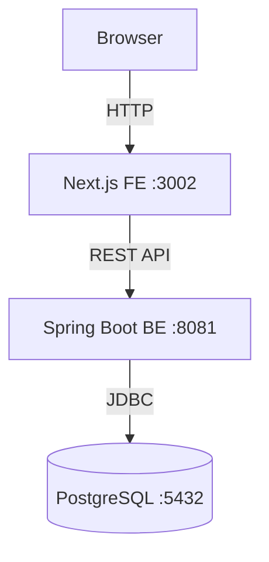

# Skill: Creating Accessible Diagrams

**Category**: Documentation
**Purpose**: Standards for creating diagrams that are accessible to all users, including those using screen readers or with visual impairments
**Used By**: documentation-writer, docs-validator

---

## Overview

Diagrams communicate system structure, data flow, and relationships visually. Without accessibility standards, users relying on screen readers or those with color vision deficiencies cannot access this information.

Every diagram in `docs/` must be **understandable without seeing the image**.

---

## Core Rules

### 1. Always Provide Alt Text

Every image must have a descriptive alt text that conveys the same information as the diagram.

**Format**: ``

**Bad:**

```markdown


```

**Good:**

```markdown

```

Alt text rule: if you removed the image, would a reader still understand the key point? If yes, alt text is sufficient.

---

### 2. Never Rely on Color Alone

Color must not be the only way to convey information. Always pair color with a label, pattern, or symbol.

**Bad** — color only:

```text
Green nodes = healthy services
Red nodes    = failed services
```

**Good** — color + label:

```text
● [OK] Next.js FE    (green)
● [FAIL] Spring Boot (red)
```

**IKP-Labs context**: CI pipeline diagrams, status dashboards, and flow diagrams must label states explicitly — not just use color.

---

### 3. Use the Verified Accessible Color Palette

**Use only these colors** in diagrams. This palette is verified to work for all color
blindness types and meets WCAG AA contrast standards:

| Color  | Hex Code  | Use Cases                      | WCAG AA (Light) | WCAG AA (Dark) |
|--------|-----------|---------------------------------|------------------|-----------------|
| Blue   | `#0173B2` | Primary elements, main flow     | ✅ 8.59:1 (AAA)  | ✅ 6.93:1 (AAA) |
| Orange | `#DE8F05` | Warnings, decisions, secondary  | ✅ 6.48:1 (AAA)  | ✅ 5.24:1 (AAA) |
| Teal   | `#029E73` | Success, validation, tertiary   | ✅ 8.33:1 (AAA)  | ✅ 6.74:1 (AAA) |
| Purple | `#CC78BC` | Special states                  | ✅ 4.51:1 (AA)   | ✅ 3.65:1 (AA)  |
| Brown  | `#CA9161` | Neutral/secondary elements      | ✅ 5.23:1 (AAA)  | ✅ 4.23:1 (AAA) |
| Black  | `#000000` | Text on light, borders          | ✅ 21.00:1 (AAA) | N/A             |
| White  | `#FFFFFF` | Text on dark, backgrounds       | N/A              | ✅ 21.00:1 (AAA)|
| Gray   | `#808080` | Disabled/secondary elements     | ✅ 7.00:1 (AAA)  | ✅ 4.00:1 (AA)  |

### 4. Never Use These Colors

Where color conveys information, never use:

- ❌ **Red** (`#FF0000`, `#E74C3C`) — invisible to protanopia/deuteranopia (~8% of males)
- ❌ **Green** (`#00FF00`, `#27AE60`) — invisible to protanopia/deuteranopia
- ❌ **Yellow** (`#FFFF00`, `#F1C40F`) — invisible to tritanopia (rare but severe)
- ❌ **Red-green combinations** — impossible contrast for the affected ~8% of males

**Exception**: emoji status indicators (🔴🟠🟡🟢) may use standard colors when *always*
paired with a text label — color is supplementary there, not the primary identifier.

---

### 5. Provide a Text Equivalent for Complex Diagrams

For diagrams with more than 3 components or non-trivial relationships, add a text equivalent below the image. Use a table or bullet list.

**Example — KameraVue architecture:**

```markdown


**Components:**

| Component | Port | Connects To |
|-----------|------|-------------|
| Browser | — | Next.js FE (HTTP) |
| Next.js FE | 3002 | Spring Boot BE (REST) |
| Spring Boot BE | 8081 | PostgreSQL (JDBC) |
| PostgreSQL | 5432 | — |
```

---

### 6. Use Mermaid for Text-Based Diagrams

Prefer Mermaid diagrams over image files where possible. Mermaid source is readable as plain text and version-controlled.

````markdown

```mermaid
graph TD
    Browser -->|HTTP| FE[Next.js FE :3002]
    FE -->|REST API| BE[Spring Boot BE :8081]
    BE -->|JDBC| DB[(PostgreSQL :5432)]
```
````

Mermaid diagrams **still require** a text equivalent when relationships are complex (more than 4 nodes or conditional flows).

**Comment syntax**: use `%%` for comments. Do not use `%%{ ... }%%` — it breaks rendering.


```mermaid
%% Correct comment
graph TD
    A --> B
```

**Escaping special characters** — parentheses, brackets, braces, and angle brackets in
node text and edge labels must use HTML entity codes, or Mermaid's parser misreads them
as syntax:

| Character | Entity Code | Example |
|-----------|-------------|---------|
| `(` | `#40;` | `A[uploadPhoto#40;file#41;]` |
| `)` | `#41;` | same as above |
| `[` | `#91;` | `B[photos#91;index#93;]` |
| `]` | `#93;` | same as above |
| `{` | `#123;` | `C[Config#123;key#125;]` |
| `}` | `#125;` | same as above |
| `<` | `#60;` | `D[Promise#60;Photo#62;]` |
| `>` | `#62;` | same as above |

Literal quotes also break rendering — remove them or use descriptive text instead:
`F[let x = "hello"]` fails; `F[Variable Assignment]` works.

---

### 7. Accessible Caption Format

Add a caption below every diagram that summarizes the key insight — not just a title.

**Bad**: `*Figure 1: Architecture*`

**Good**: `*Figure 1: KameraVue uses a three-tier architecture — FE, BE, and database — each running as a separate process.*`

---

## Diagram Types in IKP-Labs

| Diagram type | Where used | Key accessibility requirement |
|---|---|---|
| Architecture overview | `docs/explanation/` | Text equivalent table required |
| CI/CD pipeline | `docs/how-to/` | Label each stage, not just color |
| Auth flow | `docs/explanation/` | Step numbers + alt text |
| Data flow | `docs/reference/` | Table equivalent required |
| E2E test flow | `docs/how-to/` | Mermaid preferred |

---

## Validation Checklist

Before publishing any diagram:

- [ ] Alt text present and descriptive (not "diagram" or filename)
- [ ] No information conveyed by color alone
- [ ] Only colors from the Verified Accessible Color Palette used; no red/green/yellow where color conveys information
- [ ] Text equivalent provided for diagrams with more than 3 components
- [ ] Mermaid used instead of image where feasible
- [ ] Mermaid special characters escaped (entity codes, not literal quotes)
- [ ] Caption summarizes key insight, not just title

---

## Related Skills

- **docs-applying-content-quality** — Overall documentation quality standards
- **docs-applying-diataxis-framework** — Where diagrams belong in the four categories

---

**Last Updated**: 2026-06-12
