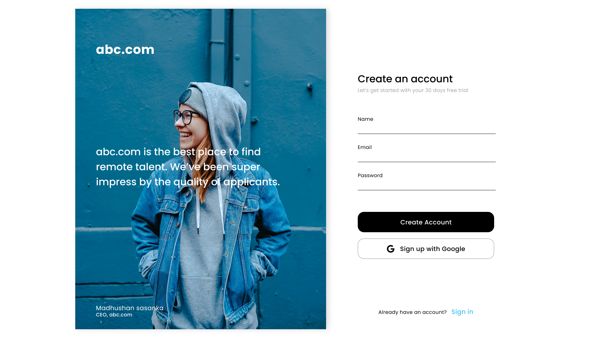
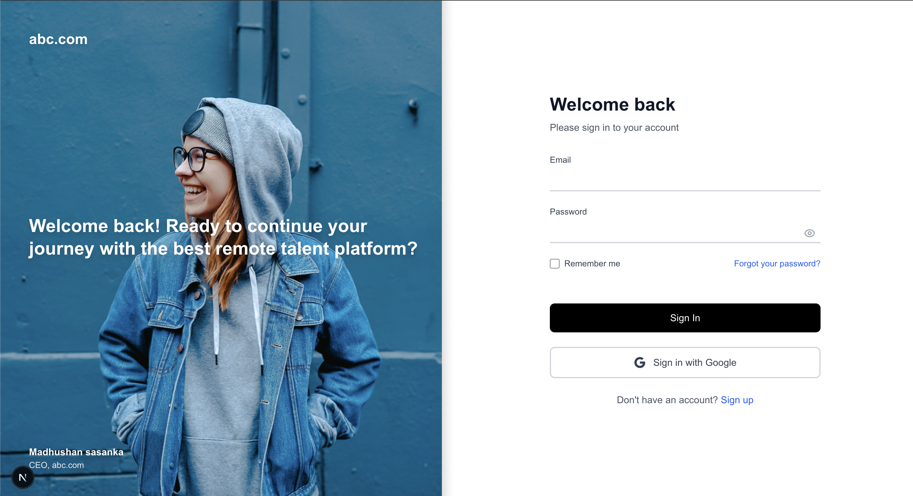

# Registration Form Template

A modern, responsive registration form template built with Next.js and Tailwind CSS. This monorepo contains a complete frontend implementation with placeholder for backend development. The frontend provides a clean, professional-looking registration page with a hero section and form layout that's perfect for any web application.





## Features

- **Modern Design**: Clean and professional UI with a two-panel layout
- **Responsive**: Fully responsive design that works on all devices
- **Hero Section**: Beautiful left panel with customizable hero content
- **Form Components**: Complete registration form with validation ready fields
- **Google Integration**: Ready-to-use Google sign-up button
- **TypeScript**: Fully typed for better development experience
- **Monorepo Structure**: Organized with separate frontend and backend directories
- **Workspace Management**: NPM workspaces for easy development

## Tech Stack

- **[Next.js 15.5.0](https://nextjs.org)** - React framework for production
- **[React 19.1.0](https://reactjs.org)** - JavaScript library for building user interfaces
- **[TypeScript](https://www.typescriptlang.org)** - Typed JavaScript for better development experience
- **[Tailwind CSS 4](https://tailwindcss.com)** - Utility-first CSS framework
- **[ESLint](https://eslint.org)** - Code linting and formatting

## Getting Started

1. Clone the repository
2. Install dependencies:

```bash
npm install
```

3. Run the development server:

```bash
# From root directory (recommended)
npm run dev
# or
npm run dev:frontend

# Or from frontend directory
cd frontend
npm run dev
```

4. Open [http://localhost:3001/register](http://localhost:3001/register) with your browser to see the registration form.
5. Open [http://localhost:3001/login](http://localhost:3001/login) for the login form.

## Project Structure

```
project-root/
├── frontend/                    # Frontend React/Next.js application
│   ├── src/app/register/       # Registration page route
│   ├── src/app/login/          # Login page route
│   ├── src/components/         # React components
│   ├── public/images/          # Static images
│   └── package.json            # Frontend dependencies
├── backend/                     # Backend placeholder (ready for implementation)
└── package.json                 # Workspace management
```

### Key Files
- `frontend/src/app/register/page.tsx` - Registration page route
- `frontend/src/app/login/page.tsx` - Login page route
- `frontend/src/components/RegistrationForm.tsx` - Main registration form component
- `frontend/src/components/LoginForm.tsx` - Main login form component
- `frontend/public/images/` - Static images including hero images
- `frontend/src/app/globals.css` - Global styles and Tailwind CSS imports

## Learn More

To learn more about Next.js, take a look at the following resources:

- [Next.js Documentation](https://nextjs.org/docs) - learn about Next.js features and API.
- [Learn Next.js](https://nextjs.org/learn) - an interactive Next.js tutorial.

You can check out [the Next.js GitHub repository](https://github.com/vercel/next.js) - your feedback and contributions are welcome!

## Deploy on Vercel

The easiest way to deploy your Next.js app is to use the [Vercel Platform](https://vercel.com/new?utm_medium=default-template&filter=next.js&utm_source=create-next-app&utm_campaign=create-next-app-readme) from the creators of Next.js.

Check out our [Next.js deployment documentation](https://nextjs.org/docs/app/building-your-application/deploying) for more details.