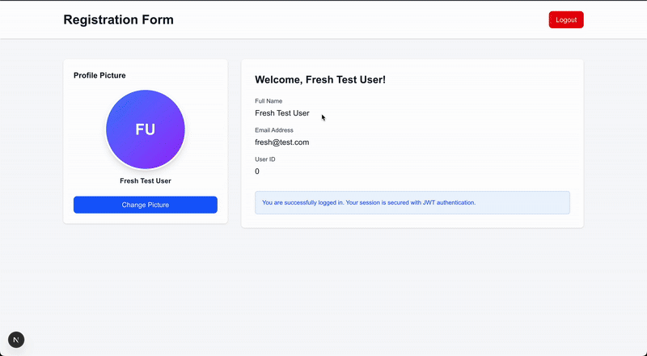
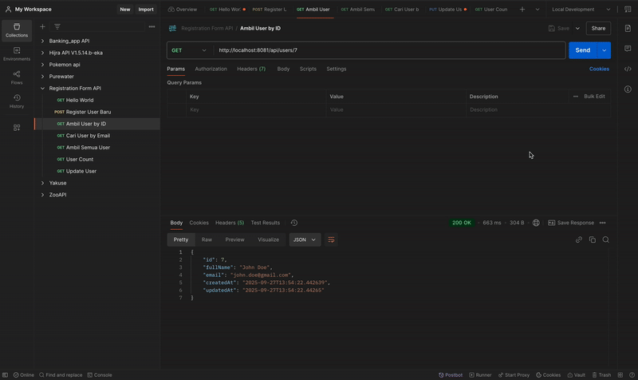

# Full-Stack Authentication System | IKP Labs

A complete user authentication and profile management system built as part of my full-stack development journey. Features Next.js, Spring Boot, JWT authentication, profile management, and comprehensive testing.

> Part of [IKP Labs](https://github.com/isnendyankp/ikp-labs) - My personal learning laboratory for full-stack development


## Features

### Complete User Journey
- **Register → Login → Homepage → Profile Picture Upload**
- Full authentication flow with seamless transitions
- Protected homepage with user information display
- Profile picture management (upload/delete) with JWT authentication

### Authentication & Security
- **JWT Authentication**: Complete token-based authentication system
- **Protected Routes**: Auto-redirect based on authentication status
- **Token Management**: Secure localStorage-based token handling
- **Password Security**: BCrypt password hashing
- **CORS Configuration**: Secure cross-origin request handling

### User Profile Management
- **Profile Picture Upload**: Upload JPEG/PNG images (max 5MB)
- **Profile Picture Delete**: Remove profile pictures with confirmation
- **Avatar Fallback**: Automatic initials-based avatar when no picture
- **Picture Persistence**: Profile pictures stored in backend and persisted
- **File Validation**: Client-side and server-side validation
- **Protected Endpoints**: JWT-secured profile APIs

### User Interface
- **Modern Design**: Clean and professional UI with two-panel layout
- **Responsive**: Fully responsive design that works on all devices
- **Hero Section**: Beautiful left panel with customizable hero content
- **Form Validation**: Client-side and server-side validation
- **Loading States**: Professional loading indicators
- **Error Handling**: User-friendly error messages
- **Homepage Dashboard**: Welcome page with user info and profile management

### Testing & Quality
- **E2E Testing**: 30+ Playwright E2E test scenarios covering:
  - Registration flows (6 tests)
  - Login flows (4 tests)
  - Complete authentication journey (8 tests)
  - Profile picture upload/delete (10 tests)
  - Video recording and screenshot capture
- **API Testing**: 20+ API test scenarios with Playwright
- **Unit Testing**: 91 comprehensive unit tests with 100% pass rate
  - JwtUtil: 15 tests (token generation, validation, expiration)
  - UserService: 17 tests (CRUD operations, business logic)
  - FileStorageService: 21 tests (file upload, validation, security)
  - UserController: 20 tests (REST endpoints)
  - ProfileController: 18 tests (profile management)
  - Execution time: 3.3 seconds total
  - Code coverage: ~91%
- **Test Plan Checklist**: Smart test execution tracking with automated progress monitoring
  - Plan-driven testing with JSON-based checklists
  - Conditional cleanup: auto-delete on pass, preserve on fail for debugging
  - Progress tracking and historical record of test execution
  - Test data management with pattern-based user identification
- **Code Quality**: Automated quality checks with check-warnings.sh
  - Pre-commit warning detection
  - Unused import scanning
  - Maven compilation validation
- **Test Coverage**: 100% critical path coverage
- **Gherkin Specs**: 18+ BDD scenarios in plain language
- **Test Automation**: Automated video/screenshot recording for demos
- **Comprehensive Documentation**: Diátaxis framework with 20+ guides including testing strategy docs

### Development
- **TypeScript**: Fully typed for better DX
- **Monorepo Structure**: Organized with workspaces
- **AI-Assisted**: Claude agents for docs, specs, and planning
- **Hot Reload**: Fast development with Next.js and Spring Boot DevTools

---

## 📚 Learning Outcomes

This project helped me master:

- ✅ **Full-Stack Architecture** - Building scalable applications with Next.js frontend and Spring Boot backend
- ✅ **JWT Authentication** - Implementing secure token-based authentication from scratch
- ✅ **File Upload & Storage** - Managing multipart file uploads and server-side storage
- ✅ **E2E Testing** - Writing comprehensive Playwright tests (30+ scenarios)
- ✅ **Unit Testing** - 91 Java unit tests with JUnit 5 and Mockito achieving 100% pass rate
- ✅ **Test Automation Strategy** - Test Plan Checklist system with smart conditional cleanup
- ✅ **Code Quality Automation** - Automated warning detection and pre-commit checks
- ✅ **Test Data Management** - Pattern-based user identification and cleanup strategies
- ✅ **Database Design** - PostgreSQL schema design and JPA entity mapping
- ✅ **RESTful API Design** - Creating consistent and well-documented APIs
- ✅ **Security Best Practices** - BCrypt password hashing, CORS configuration, JWT validation
- ✅ **Protected Routes** - Client-side and server-side authorization
- ✅ **State Management** - React hooks and localStorage for auth state
- ✅ **Modern UI/UX** - Responsive design with Tailwind CSS
- ✅ **Documentation** - Comprehensive docs following Diátaxis framework (20+ guides)
- ✅ **Project Organization** - Structured plans categorized by domain (Backend/Frontend/Testing)

## 🎯 What I Built

This started as a simple registration form but evolved into a complete authentication system as I learned and added more features:

**Phase 1 - Foundation (Week 1-2)**
- Basic registration form with validation
- PostgreSQL database setup
- Spring Boot REST API

**Phase 2 - Authentication (Week 3)**
- Login functionality
- JWT token generation and validation
- Secure password hashing with BCrypt

**Phase 3 - Protected Features (Week 4)**
- Protected homepage dashboard
- Route guards and redirects
- User information display from JWT

**Phase 4 - Profile Management (Week 5)**
- Profile picture upload/delete
- File validation and storage
- Avatar fallback system

**Phase 5 - Testing & Quality (Week 6)**
- 30+ E2E tests with Playwright
- Java unit tests (UserService, JwtUtil)
- Test automation and CI/CD preparation

**Phase 6 - Documentation (Ongoing)**
- Comprehensive README
- API documentation
- 15+ guides (tutorials, how-tos, references)
- BDD specifications with Gherkin

---

## Tech Stack

### Frontend
- **[Next.js 15.5.0](https://nextjs.org)** - React framework for production
- **[React 19.1.0](https://reactjs.org)** - JavaScript library for building user interfaces
- **[TypeScript](https://www.typescriptlang.org)** - Typed JavaScript for better development experience
- **[Tailwind CSS 4](https://tailwindcss.com)** - Utility-first CSS framework
- **[ESLint](https://eslint.org)** - Code linting and formatting

### Backend
- **[Java 17+](https://openjdk.java.net/)** - Programming language
- **[Spring Boot 3.3.6](https://spring.io/projects/spring-boot)** - Java framework
- **[Spring Security](https://spring.io/projects/spring-security)** - Authentication & authorization
- **[PostgreSQL](https://www.postgresql.org/)** - Relational database
- **[Spring Data JPA](https://spring.io/projects/spring-data-jpa)** - Data persistence layer
- **[JWT (jjwt 0.12.3)](https://github.com/jwtk/jjwt)** - JSON Web Token implementation
- **[BCrypt](https://docs.spring.io/spring-security/site/docs/current/api/org/springframework/security/crypto/bcrypt/BCryptPasswordEncoder.html)** - Password encryption
- **[Maven](https://maven.apache.org/)** - Build and dependency management

### Testing
- **[Playwright](https://playwright.dev/)** - E2E and API testing framework
- **[Gherkin](https://cucumber.io/docs/gherkin/)** - BDD specification language
- **Test Utilities**: Custom helpers for API client, auth, test data, cleanup

## Getting Started

1. Clone the repository
2. Install dependencies:

```bash
npm install
```

3. Run the development server:

```bash
# From root directory (recommended)
npm run dev
# or
npm run dev:frontend

# Or from frontend directory
cd frontend
npm run dev
```

4. Open your browser and navigate to:
   - [http://localhost:3001/register](http://localhost:3001/register) - Registration form
   - [http://localhost:3001/login](http://localhost:3001/login) - Login form
   - [http://localhost:3001/home](http://localhost:3001/home) - Homepage (requires authentication)

### Complete User Journey

**Try the full flow:**
1. Register a new account at `/register`
2. Automatically redirected to `/home` after successful registration
3. View your profile with user information
4. Upload a profile picture (JPEG/PNG, max 5MB)
5. Delete and re-upload profile pictures
6. Logout to end session

**Demo Video - Profile Picture Upload:**



*Watch the complete flow of uploading a profile picture successfully*

**Alternative flow:**
1. Login with existing credentials at `/login`
2. Redirected to `/home` dashboard
3. Manage your profile and pictures

## Project Structure

```
project-root/
├── .claude/                    # Claude AI agents configuration
│   ├── agents/                # Specialized agents
│   │   ├── gherkin-spec-writer.md      # BDD test scenario writer
│   │   ├── documentation-writer.md     # Documentation specialist
│   │   └── plan-writer.md              # Implementation planner
│   └── settings.json          # Agent hooks and configuration
├── frontend/                   # Frontend React/Next.js application
│   ├── src/app/
│   │   ├── register/          # Registration page route
│   │   ├── login/             # Login page route
│   │   └── home/              # 🆕 Protected homepage with profile management
│   ├── src/components/        # React components
│   │   ├── RegistrationForm.tsx
│   │   ├── LoginForm.tsx
│   │   ├── LogoutButton.tsx
│   │   ├── ProfilePicture.tsx           # 🆕 Profile picture display
│   │   └── ProfilePictureUpload.tsx     # 🆕 Upload component
│   ├── src/services/          # 🆕 API service layer
│   │   └── profileService.ts  # 🆕 Profile picture APIs
│   ├── src/lib/               # Utility functions
│   │   └── auth.ts            # JWT token management
│   ├── public/images/         # Static images
│   ├── public/videos/         # Demo videos (Postman testing)
│   └── package.json           # Frontend dependencies
├── backend/                    # Backend Java Spring Boot API
│   └── registration-form-api/ # Spring Boot application
│       ├── src/main/java/     # Java source code
│       │   └── com/registrationform/api/
│       │       ├── controller/   # REST API endpoints (@RestController)
│       │       │   ├── UserController.java
│       │       │   ├── AuthController.java       # 🆕 Login/Register
│       │       │   └── ProfileController.java    # 🆕 Profile picture APIs
│       │       ├── service/      # Business logic (@Service - Singleton)
│       │       │   ├── UserService.java
│       │       │   ├── AuthService.java          # 🆕 Authentication
│       │       │   ├── JwtUtil.java              # 🆕 JWT utilities
│       │       │   └── FileStorageService.java   # 🆕 File upload/delete
│       │       ├── repository/   # Data access layer (@Repository - Singleton)
│       │       ├── entity/       # JPA database entities
│       │       ├── dto/          # Data Transfer Objects
│       │       ├── validation/   # Custom validation components
│       │       ├── exception/    # Error handling
│       │       └── security/     # 🆕 Security configuration
│       │           ├── SecurityConfig.java
│       │           └── JwtAuthenticationFilter.java
│       ├── src/main/resources/   # Configuration files
│       │   └── application.properties
│       ├── src/test/java/        # 🆕 Unit tests
│       │   └── com/registrationform/api/
│       │       ├── service/
│       │       │   ├── UserServiceTest.java
│       │       │   └── JwtUtilTest.java
│       │       └── util/
│       ├── uploads/profiles/     # 🆕 Uploaded profile pictures
│       └── pom.xml               # Maven dependencies
├── tests/                      # Playwright E2E tests
│   ├── e2e/                   # Test specs
│   │   ├── registration.spec.ts
│   │   ├── login.spec.ts
│   │   ├── auth-flow.spec.ts           # 🆕 Complete auth journey
│   │   ├── profile-picture.spec.ts     # 🆕 Upload/delete tests
│   │   ├── demo-video-recording.spec.ts
│   │   └── demo-screenshot-capture.spec.ts
│   └── fixtures/              # Test data (images for upload tests)
├── specs/                      # Gherkin specifications (BDD)
│   └── authentication/        # Auth feature specs
├── docs/                       # Documentation (Diátaxis framework)
│   ├── tutorials/             # Learning-oriented guides
│   ├── how-to/                # Problem-solving guides
│   │   ├── testing/
│   │   │   └── run-automated-tests.md          # 🆕 Test execution guide
│   │   ├── upload-profile-picture.md
│   │   ├── run-e2e-tests.md
│   │   └── implement-protected-routes.md
│   ├── reference/             # Technical specifications
│   ├── explanation/           # Conceptual explanations
│   │   ├── testing/
│   │   │   └── test-plan-checklist-strategy.md # 🆕 Testing strategy
│   │   ├── authentication-architecture.md
│   │   └── protected-routes-architecture.md
│   └── testing/               # 🆕 Testing documentation
│       ├── unit-test-java-guide.md
│       └── video-screenshot-guide.md
├── plans/                      # Implementation plans (organized by domain)
│   ├── in-progress/           # Active development plans
│   │   ├── backend/           # Backend-related plans
│   │   │   └── testing-automation/  # 30% complete (unit tests done)
│   │   ├── frontend/          # Frontend-related plans
│   │   │   └── authentication-flow/
│   │   └── testing/           # Testing-related plans
│   │       └── api-testing-playwright/
│   └── completed/             # Completed plans by category
│       ├── backend/           # Completed backend plans
│       ├── frontend/          # Completed frontend plans
│       └── testing/           # 🆕 Completed testing plans
│           └── unit-tests/    # 🆕 91 tests, 100% pass rate!
└── package.json                # Workspace management

🆕 = New features/files added in latest version
```

### Key Files

#### Frontend
- `frontend/src/app/register/page.tsx` - Registration page route
- `frontend/src/app/login/page.tsx` - Login page route
- `frontend/src/app/home/page.tsx` - 🆕 Protected homepage with profile management
- `frontend/src/components/RegistrationForm.tsx` - Main registration form component
- `frontend/src/components/LoginForm.tsx` - Main login form component
- `frontend/src/components/ProfilePicture.tsx` - 🆕 Profile picture display component
- `frontend/src/components/ProfilePictureUpload.tsx` - 🆕 Profile picture upload component
- `frontend/src/components/LogoutButton.tsx` - 🆕 Logout functionality
- `frontend/src/services/profileService.ts` - 🆕 Profile picture API calls
- `frontend/src/lib/auth.ts` - JWT token management utilities
- `frontend/public/images/` - Static images including hero images
- `frontend/src/app/globals.css` - Global styles and Tailwind CSS imports

#### Backend
- `backend/registration-form-api/src/main/java/com/registrationform/api/RegistrationFormApiApplication.java` - Main Spring Boot application
- `backend/registration-form-api/src/main/java/com/registrationform/api/controller/AuthController.java` - 🆕 Login/Register endpoints
- `backend/registration-form-api/src/main/java/com/registrationform/api/controller/ProfileController.java` - 🆕 Profile picture upload/delete endpoints
- `backend/registration-form-api/src/main/java/com/registrationform/api/controller/UserController.java` - User management endpoints
- `backend/registration-form-api/src/main/java/com/registrationform/api/service/AuthService.java` - 🆕 Authentication service
- `backend/registration-form-api/src/main/java/com/registrationform/api/service/JwtUtil.java` - 🆕 JWT token generation/validation
- `backend/registration-form-api/src/main/java/com/registrationform/api/service/FileStorageService.java` - 🆕 File upload/storage service
- `backend/registration-form-api/src/main/java/com/registrationform/api/service/UserService.java` - User business logic (Singleton)
- `backend/registration-form-api/src/main/java/com/registrationform/api/repository/UserRepository.java` - Data access repository (Singleton)
- `backend/registration-form-api/src/main/java/com/registrationform/api/entity/User.java` - JPA entity for database mapping
- `backend/registration-form-api/src/main/java/com/registrationform/api/security/SecurityConfig.java` - 🆕 Spring Security configuration
- `backend/registration-form-api/src/main/java/com/registrationform/api/security/JwtAuthenticationFilter.java` - 🆕 JWT filter
- `backend/registration-form-api/src/main/resources/application.properties` - Database and server configuration

#### Testing
- `tests/e2e/registration.spec.ts` - Registration E2E tests
- `tests/e2e/login.spec.ts` - Login E2E tests
- `tests/e2e/auth-flow.spec.ts` - 🆕 Complete authentication journey tests
- `tests/e2e/profile-picture.spec.ts` - 🆕 Profile picture upload/delete tests
- `tests/fixtures/` - Test images and data for E2E tests
- `backend/registration-form-api/src/test/java/` - 🆕 Java unit tests

## Testing

### E2E Testing with Playwright 🎭

The application includes comprehensive automated end-to-end tests using Playwright covering the complete user journey from registration to profile management.

#### Running E2E Tests

**Prerequisites:**
- Backend server running on `http://localhost:8081`
- Frontend server running on `http://localhost:3001`

**Run all tests:**
```bash
npx playwright test
```

**Run specific test suite:**
```bash
# Registration tests (6 tests)
npx playwright test tests/e2e/registration.spec.ts

# Login tests (4 tests)
npx playwright test tests/e2e/login.spec.ts

# Complete authentication flow (8 tests)
npx playwright test tests/e2e/auth-flow.spec.ts

# Profile picture tests (10 tests)
npx playwright test tests/e2e/profile-picture.spec.ts
```

**Run with UI mode (interactive):**
```bash
npx playwright test --ui
```

**Run in headed mode (see browser):**
```bash
npx playwright test --headed
```

**Debug mode:**
```bash
npx playwright test --debug
```

**View test report:**
```bash
npx playwright show-report
```

#### Test Coverage

**1. Registration Flow Tests (6 tests):**
- ✅ Valid registration
- ✅ Duplicate email handling
- ✅ Empty fields validation
- ✅ Email format validation
- ✅ Loading state verification
- ✅ CORS configuration

**2. Login Flow Tests (4 tests):**
- ✅ Valid login credentials
- ✅ Invalid password handling
- ✅ Non-existent email handling (security best practice verified)
- ✅ CORS configuration

**3. Complete Authentication Journey Tests (8 tests):**
- ✅ Register → Auto-redirect to home
- ✅ Login → Redirect to home
- ✅ Home page displays user info from JWT
- ✅ Logout clears token and redirects to login
- ✅ Unauthenticated user redirected from home
- ✅ Authenticated user redirected from login to home
- ✅ Authenticated user redirected from register to home
- ✅ Token persists across page refresh

**4. Profile Picture Tests (10 tests):**
- ✅ Upload JPEG profile picture
- ✅ Upload PNG profile picture
- ✅ Delete profile picture
- ✅ Complete flow: Register → Login → Upload → Delete → Logout
- ✅ Multiple upload/delete cycles
- ✅ Picture persists after page refresh
- ✅ Reject files larger than 5MB
- ✅ Reject non-image files
- ✅ Replace existing profile picture
- ✅ Unauthenticated user cannot access upload

**5. Demo & Documentation Tests:**
- ✅ Video recording for demos
- ✅ Screenshot capture for documentation

**Total: 30+ E2E test scenarios**

**Test Documentation:**
- E2E guide: [docs/how-to/run-e2e-tests.md](docs/how-to/run-e2e-tests.md)
- Profile picture tests: [docs/plans/profile-picture-e2e-test-plan.md](docs/plans/profile-picture-e2e-test-plan.md)
- Video/screenshot guide: [docs/testing/video-screenshot-guide.md](docs/testing/video-screenshot-guide.md)

---

## Backend API Testing

### API Endpoints

The backend provides comprehensive REST APIs for authentication and user management.

#### Authentication Endpoints

**POST** `/api/auth/register` - Register new user
- Request body: `{ fullName, email, password, confirmPassword }`
- Returns: JWT token + user info
- Auto-login after registration

**POST** `/api/auth/login` - Login user
- Request body: `{ email, password }`
- Returns: JWT token + user info
- Token valid for session

#### Profile Picture Endpoints (JWT Protected)

**GET** `/api/profile/picture` - Get current user's profile picture
- Requires: JWT token in Authorization header
- Returns: Profile picture URL or null

**POST** `/api/profile/picture` - Upload profile picture
- Requires: JWT token + multipart/form-data
- Accepts: JPEG, PNG (max 5MB)
- Returns: Uploaded picture URL

**DELETE** `/api/profile/picture` - Delete profile picture
- Requires: JWT token
- Returns: Success message
- Reverts to avatar fallback

#### User Management Endpoints

- ✅ **POST** `/api/users` - Register new user
- ✅ **GET** `/api/users` - Get all users
- ✅ **GET** `/api/users/{id}` - Get user by ID
- ✅ **PUT** `/api/users/{id}` - Update user (supports partial update)
- ✅ **DELETE** `/api/users/{id}` - Delete user
- ✅ **GET** `/api/users/email/{email}` - Get user by email
- ✅ **GET** `/api/users/check-email/{email}` - Check if email exists
- ✅ **GET** `/api/users/count` - Get total user count

### Local Testing with Postman ✅

#### Demo Video

**GET Endpoints Testing:**



**Key Features Verified:**
- ✅ JWT authentication flow
- ✅ Protected endpoints with token validation
- ✅ File upload (multipart/form-data)
- ✅ Input validation (email format, required fields)
- ✅ Partial update support (update without password)
- ✅ Duplicate email prevention
- ✅ Proper HTTP status codes (200, 201, 400, 401, 404)
- ✅ JSON response format
- ✅ Database persistence with PostgreSQL
- ✅ File storage for profile pictures

**Test Environment:**
- Backend: `http://localhost:8081`
- Database: PostgreSQL
- File Storage: `backend/registration-form-api/uploads/profiles/`
- Testing Tool: Postman

### Unit Testing (Java) ✅

Comprehensive unit test suite covering all business logic and API endpoints.

**Run unit tests:**
```bash
cd backend/registration-form-api
mvn test

# Output:
# Tests run: 91, Failures: 0, Errors: 0, Skipped: 0
# Time elapsed: 3.3 seconds
```

**Test Statistics:**
- **Total Tests**: 91 unit tests
- **Pass Rate**: 100% (0 failures, 0 errors)
- **Execution Time**: 3.3 seconds
- **Code Coverage**: ~91%
- **Test Files**: 5 comprehensive test classes

**Test Breakdown by Component:**

**1. JwtUtilTest (15 tests)**
- Token generation and validation
- Email extraction from tokens
- Token expiration handling
- Full name extraction
- Token refresh functionality
- Invalid/malformed/expired token scenarios

**2. UserServiceTest (17 tests)**
- CRUD operations (Create, Read, Update, Delete)
- User retrieval by ID and email
- Duplicate email handling
- Password verification
- Email existence checks
- Edge cases (non-existent users, empty lists)

**3. FileStorageServiceTest (21 tests)**
- File upload validation (size, type, extension)
- Supported formats (PNG, JPG, JPEG, GIF, WebP)
- File size limits (5MB max)
- Invalid file type rejection (PDF, TXT, EXE)
- File replacement logic
- File deletion handling
- Edge cases (null files, empty files, no extension)

**4. UserControllerTest (20 tests)**
- REST API endpoint testing
- GET, POST, PUT, DELETE operations
- HTTP status code validation
- Request/response body validation
- Error scenario handling

**5. ProfileControllerTest (18 tests)**
- Profile picture upload endpoint
- Profile picture deletion
- Multipart file upload handling
- User not found scenarios
- IO error handling

**Code Quality Tools:**
```bash
# Check for warnings and code quality issues
./check-warnings.sh

# Output:
# ✅ No Maven compilation warnings
# ✅ No common unused imports found
# ✅ All tests passing
# 🎉 All checks passed! Code is clean!
```

**Documentation:**
- Unit test summary: [plans/completed/testing/unit-tests/README.md](plans/completed/testing/unit-tests/README.md)
- How-to guide: [docs/how-to/testing/run-automated-tests.md](docs/how-to/testing/run-automated-tests.md)
- Testing strategy: [docs/explanation/testing/test-plan-checklist-strategy.md](docs/explanation/testing/test-plan-checklist-strategy.md)

---

## Claude AI Agents 🤖

This project includes specialized Claude agents to assist with development:

### 📝 gherkin-spec-writer
**Purpose**: Write BDD test scenarios in Gherkin format

Creates behavior specifications that are:
- Readable by non-technical stakeholders
- Aligned with Playwright E2E tests
- Following 1-1-1 rule (1 Given, 1 When, 1 Then)

**Usage**: "Create Gherkin specs for password reset feature"

**Location**: [specs/](./specs/)

### 📚 documentation-writer
**Purpose**: Create and maintain structured documentation

Organizes docs using Diátaxis framework:
- **Tutorials**: Step-by-step learning guides
- **How-To Guides**: Problem-solving instructions
- **Reference**: Technical specifications
- **Explanation**: Conceptual understanding

**Usage**: "Document the JWT authentication flow"

**Location**: [docs/](./docs/)

### 📋 plan-writer
**Purpose**: Create implementation plans for features

Generates 4-document plans:
- README: Overview and status
- requirements.md: Scope and user stories
- technical-design.md: Architecture
- checklist.md: Tasks and validation

**Usage**: "Create implementation plan for user profile editing"

**Location**: [plans/](./plans/)

### Why Use Agents?

✅ **Consistency**: Always follow project conventions
✅ **Completeness**: Never forget important details
✅ **Quality**: Maintain high documentation standards
✅ **Efficiency**: Faster than writing manually

See [.claude/agents/](./.claude/agents/) for agent definitions.

---

## What's New in Latest Version? 🆕

### Complete User Journey Implementation

The application now supports the complete user journey from registration to profile management:

**1. Registration & Authentication Flow**
- User registers with email/password → Receives JWT token → Auto-redirect to homepage
- User can login with credentials → Receives JWT token → Redirect to homepage
- Protected routes with automatic redirect based on authentication status
- Token persistence in localStorage with page refresh support

**2. Homepage Dashboard**
- Protected route accessible only to authenticated users
- Displays user information from JWT token (name, email, user ID)
- Shows authentication status and security message
- Clean, modern UI with responsive design
- Logout functionality that clears token and redirects to login

**3. Profile Picture Management**
- Upload profile pictures (JPEG/PNG, max 5MB)
- Delete profile pictures with confirmation dialog
- Automatic fallback to initials-based avatar
- Profile pictures stored in backend and persisted across sessions
- Real-time UI updates after upload/delete operations
- File validation on both client and server side

**Demo Video:**


*Live demonstration of profile picture upload functionality*

**4. Comprehensive E2E Testing**
- 30+ Playwright test scenarios covering entire user journey
- Tests for registration, login, authentication flow, and profile pictures
- Automated video recording and screenshot capture for demos
- Test fixtures for upload validation (size, type)
- 100% critical path coverage

**5. Security Enhancements**
- JWT-based authentication with secure token handling
- Protected API endpoints requiring authentication
- Spring Security configuration with JWT filter
- CORS configuration for cross-origin requests
- BCrypt password hashing
- Input validation and file upload security

**6. Comprehensive Documentation**
- 15+ documentation guides following Diátaxis framework
- Tutorials for getting started and testing
- How-to guides for specific tasks
- Reference documentation for APIs
- Explanation documents for architecture concepts
- Test plans and implementation summaries

### Migration Path

If you have an existing version, the new features include:

**Frontend:**
- `/home` route with profile management
- `ProfilePicture` and `ProfilePictureUpload` components
- `profileService.ts` for API calls
- `LogoutButton` component
- Enhanced authentication utilities

**Backend:**
- `AuthController` for login/register
- `ProfileController` for profile picture operations
- `FileStorageService` for file uploads
- `JwtUtil` for token management
- Security configuration with JWT filter
- Unit tests for services

**Testing:**
- `auth-flow.spec.ts` for complete journey tests
- `profile-picture.spec.ts` for upload/delete tests
- Test fixtures for file validation
- Video/screenshot automation tests

---

## Learn More

To learn more about Next.js, take a look at the following resources:

- [Next.js Documentation](https://nextjs.org/docs) - learn about Next.js features and API.
- [Learn Next.js](https://nextjs.org/learn) - an interactive Next.js tutorial.

You can check out [the Next.js GitHub repository](https://github.com/vercel/next.js) - your feedback and contributions are welcome!

## Deploy on Vercel

The easiest way to deploy your Next.js app is to use the [Vercel Platform](https://vercel.com/new?utm_medium=default-template&filter=next.js&utm_source=create-next-app&utm_campaign=create-next-app-readme) from the creators of Next.js.

Check out our [Next.js deployment documentation](https://nextjs.org/docs/app/building-your-application/deploying) for more details.