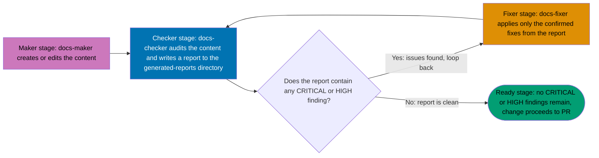

# Claude Agents Catalog

Complete reference for every Claude agent defined in `.claude/agents/` in the
IKP-Labs project.

## Overview

IKP-Labs uses **53 specialized Claude agents**, each defined by a single
Markdown file in [`.claude/agents/`](../../.claude/agents/). Agents are
grouped into **15 families** by the problem domain they work in —
Documentation, Planning, Testing & Specs, SWE Language Devs, SWE UI, SWE Code
Quality, CI, PDF Pipeline, README, Repo Governance, Repo Harness
Compatibility, PR Review, Web & API Testing/Research, Social, and Agent
Development.

Most families follow the **Maker-Checker-Fixer pattern**: a Maker agent
creates or edits content, a Checker agent audits it and writes a report to
`generated-reports/`, and a Fixer agent applies confirmed fixes from that
report. See [Maker-Checker-Fixer Pattern](#maker-checker-fixer-pattern) below
for the full workflow, and the
[`repo-applying-maker-checker-fixer`](../../.claude/skills/repo-applying-maker-checker-fixer/SKILL.md)
skill for the canonical description of the pattern itself. A few families are
singletons (one agent, no maker/checker/fixer triad) or two-role variants —
each family section below says which shape it follows.

For the conventions used to define an agent file (frontmatter structure,
naming, description quality), see the
[`agent-developing-agents`](../../.claude/skills/agent-developing-agents/SKILL.md)
skill.

## How to Read This Catalog

Every table below has four required columns:

- **Filename** — the file in `.claude/agents/`, always the agent's
  authoritative identity. Invoke an agent with `@<filename-without-.md>`.
- **Role** — Maker, Checker, Fixer, Manager, or a family-specific role for
  singleton/variant families.
- **Model** — the `model:` value in the agent's frontmatter (`sonnet` or
  `haiku` across this repo).
- **Color** — the `color:` value in the agent's frontmatter, used by the
  Claude Code UI to visually distinguish agents.

A fifth column, **Skills**, lists the skill directories the agent declares
under `permission.skill:` in its frontmatter. Where an agent's frontmatter
has no `permission.skill:` field, the table says so explicitly rather than
guessing.

**Known frontmatter/filename mismatch (4 agents).** A 2026-05-19 rename
changed 5 agent filenames (`plan-writer` → `plan-maker`,
`documentation-writer` → `docs-maker`, `docs-validator` → `docs-checker`,
`gherkin-spec-writer` → `specs-maker`, `test-validator` → `test-checker`) but
only updated the frontmatter `name:` field for `plan-maker`. The other 4 —
`docs-maker.md`, `docs-checker.md`, `specs-maker.md`, and `test-checker.md`
— still carry their pre-rename name inside the frontmatter `name:` field,
even though the filename (and every invocation in this catalog) uses the
current name. Each is flagged with ⚠ in its family table below, with an
inline note explaining the specific mismatch. This is a known, tracked
inconsistency in `.claude/agents/`, not a documentation error — fixing the
frontmatter itself is out of scope for the plan that produced this catalog
rewrite (tracked as a follow-up for `agent-maker`'s domain; see
`plans/in-progress/2026-10-08__fix-claude-agents-catalog-doc/requirements.md`
Non-Scope #1).

## Agent Families

### 1. Documentation (6 agents)

Creates, validates, fixes, and reorganizes documentation under `docs/`,
following the Diátaxis framework.

| Filename                                                            | Role    | Purpose                                                                                                                                  | Model  | Color  | Skills                                                                                                                        |
| ------------------------------------------------------------------- | ------- | ---------------------------------------------------------------------------------------------------------------------------------------- | ------ | ------ | ----------------------------------------------------------------------------------------------------------------------------- |
| [`docs-maker.md`](../../.claude/agents/docs-maker.md) ⚠             | Maker   | Creates and updates documentation following the Diátaxis framework (tutorials, how-to, reference, explanation)                           | sonnet | purple | docs-applying-content-quality, docs-applying-diataxis-framework, wow-criticality-assessment                                   |
| [`docs-checker.md`](../../.claude/agents/docs-checker.md) ⚠         | Checker | Audits API doc completeness, JSDoc coverage, and Diátaxis categorization; writes `docs-audit-*.md` reports                               | sonnet | blue   | docs-applying-content-quality, docs-applying-diataxis-framework, docs-validating-factual-accuracy, wow-criticality-assessment |
| [`docs-fixer.md`](../../.claude/agents/docs-fixer.md)               | Fixer   | Applies targeted corrections from `docs-checker` findings: categorization fixes, broken links, content gaps                              | sonnet | orange | docs-applying-content-quality, docs-applying-diataxis-framework, wow-criticality-assessment                                   |
| [`docs-file-manager.md`](../../.claude/agents/docs-file-manager.md) | Manager | Renames, moves, and deletes files inside `docs/`; preserves git history via `git mv`/`git rm`; updates internal links and README indices | haiku  | yellow | none declared                                                                                                                 |
| [`docs-link-checker.md`](../../.claude/agents/docs-link-checker.md) | Checker | Scans every Markdown file in the project for broken internal, external, and same-file anchor links; writes `link-audit-*.md` reports     | sonnet | blue   | docs-validating-links, wow-criticality-assessment                                                                             |
| [`docs-link-fixer.md`](../../.claude/agents/docs-link-fixer.md)     | Fixer   | Repairs broken links found by `docs-link-checker`, fuzzy-matching renamed/moved files via git history                                    | sonnet | orange | docs-validating-links, wow-criticality-assessment                                                                             |

⚠ `docs-maker.md`: Known issue — this agent's frontmatter `name:` field
still reads `documentation-writer` rather than `docs-maker`, a leftover from
the 2026-05-19 rename. Invocation by `@docs-maker` is the repo convention
going forward; this mismatch is tracked for a follow-up `agent-maker` fix,
out of scope for this plan — see
`plans/in-progress/2026-10-08__fix-claude-agents-catalog-doc/requirements.md`
Non-Scope #1.

⚠ `docs-checker.md`: Known issue — this agent's frontmatter `name:` field
still reads `docs-validator` rather than `docs-checker`, a leftover from the
2026-05-19 rename. Invocation by `@docs-checker` is the repo convention going
forward; this mismatch is tracked for a follow-up `agent-maker` fix, out of
scope for this plan — see
`plans/in-progress/2026-10-08__fix-claude-agents-catalog-doc/requirements.md`
Non-Scope #1.

### 2. Planning (4 agents)

Creates, validates, fixes, and gates implementation plans under the 4-document
system (`README.md`, `requirements.md`, `technical-design.md`,
`checklist.md`).

| Filename                                                                      | Role    | Purpose                                                                                                                                                                       | Model  | Color  | Skills                                                                                    |
| ----------------------------------------------------------------------------- | ------- | ----------------------------------------------------------------------------------------------------------------------------------------------------------------------------- | ------ | ------ | ----------------------------------------------------------------------------------------- |
| [`plan-maker.md`](../../.claude/agents/plan-maker.md)                         | Maker   | Creates and updates 4-document implementation plans; runs a mandatory `grill-me` interview before and after writing                                                           | sonnet | purple | plan-creating-project-plans, grill-me, wow-criticality-assessment                         |
| [`plan-checker.md`](../../.claude/agents/plan-checker.md)                     | Checker | Validates 4-document completeness, task atomicity, testable acceptance criteria, PR-review gate completion, and factual accuracy; writes `plan-audit-*.md` reports            | sonnet | purple | plan-creating-project-plans, docs-validating-factual-accuracy, wow-criticality-assessment |
| [`plan-fixer.md`](../../.claude/agents/plan-fixer.md)                         | Fixer   | Fixes plan issues found by `plan-checker`: missing documents, non-atomic tasks, vague acceptance criteria, placeholder content — never touches merge/PR governance-gate steps | sonnet | orange | plan-creating-project-plans, wow-criticality-assessment                                   |
| [`plan-execution-checker.md`](../../.claude/agents/plan-execution-checker.md) | Checker | Final quality gate before archiving a plan to `plans/done/`: validates requirements coverage, technical alignment, and archival mechanics (git mv, index update)              | sonnet | green  | plan-creating-project-plans, wow-criticality-assessment                                   |

### 3. Testing & Specs (6 agents)

Creates, validates, and fixes Gherkin specifications (`specs/`) and Playwright
E2E/API/unit tests, keeping specs and tests in sync.

| Filename                                                    | Role    | Purpose                                                                                                                                | Model  | Color  | Skills                                                                    |
| ----------------------------------------------------------- | ------- | -------------------------------------------------------------------------------------------------------------------------------------- | ------ | ------ | ------------------------------------------------------------------------- |
| [`specs-maker.md`](../../.claude/agents/specs-maker.md) ⚠   | Maker   | Creates and updates Gherkin feature files in `specs/`, following the 1-1-1 rule (1 Given, 1 When, 1 Then per scenario)                 | sonnet | purple | test-coverage-rules, test-playwright-patterns, wow-criticality-assessment |
| [`specs-checker.md`](../../.claude/agents/specs-checker.md) | Checker | Validates 1-1-1 rule compliance and specs ↔ Playwright test synchronization; writes `test-audit-*.md`-style reports                    | sonnet | blue   | test-coverage-rules, test-playwright-patterns, wow-criticality-assessment |
| [`specs-fixer.md`](../../.claude/agents/specs-fixer.md)     | Fixer   | Fixes 1-1-1 violations, adds missing edge-case scenarios, renames duplicate scenario names                                             | sonnet | orange | test-coverage-rules, test-playwright-patterns, wow-criticality-assessment |
| [`test-maker.md`](../../.claude/agents/test-maker.md)       | Maker   | Creates new Playwright E2E tests, Playwright API tests, and Jest unit tests from Gherkin specs or requirements                         | sonnet | purple | test-coverage-rules, test-playwright-patterns, wow-criticality-assessment |
| [`test-checker.md`](../../.claude/agents/test-checker.md) ⚠ | Checker | Validates E2E test coverage, specs ↔ test synchronization, and detects flaky tests/brittle selectors; writes `test-audit-*.md` reports | sonnet | blue   | test-coverage-rules, test-playwright-patterns, wow-criticality-assessment |
| [`test-fixer.md`](../../.claude/agents/test-fixer.md)       | Fixer   | Fixes failing, flaky, or brittle Playwright tests found by `test-checker`; replaces fragile selectors with `data-testid`               | sonnet | orange | test-coverage-rules, test-playwright-patterns, wow-criticality-assessment |

⚠ `specs-maker.md`: Known issue — this agent's frontmatter `name:` field
still reads `gherkin-spec-writer` rather than `specs-maker`, a leftover from
the 2026-05-19 rename. Invocation by `@specs-maker` is the repo convention
going forward; this mismatch is tracked for a follow-up `agent-maker` fix,
out of scope for this plan — see
`plans/in-progress/2026-10-08__fix-claude-agents-catalog-doc/requirements.md`
Non-Scope #1.

⚠ `test-checker.md`: Known issue — this agent's frontmatter `name:` field
still reads `test-validator` rather than `test-checker`, a leftover from the
2026-05-19 rename. Invocation by `@test-checker` is the repo convention going
forward; this mismatch is tracked for a follow-up `agent-maker` fix, out of
scope for this plan — see
`plans/in-progress/2026-10-08__fix-claude-agents-catalog-doc/requirements.md`
Non-Scope #1.

### 4. SWE Language Devs (7 agents)

Implements application code in a specific language. A singleton-per-language
family — no checker/fixer counterpart; code quality for the two IKP-Labs
languages is covered separately by the SWE Code Quality and SWE UI families.

| Filename                                                              | Purpose                                                                                                      | Model  | Color  | Skills                                                                      | Notes                                 |
| --------------------------------------------------------------------- | ------------------------------------------------------------------------------------------------------------ | ------ | ------ | --------------------------------------------------------------------------- | ------------------------------------- |
| [`swe-typescript-dev.md`](../../.claude/agents/swe-typescript-dev.md) | Implements TypeScript/Next.js frontend code: components, hooks, Jest + React Testing Library tests           | sonnet | purple | swe-programming-typescript, swe-developing-applications-common              | IKP-Labs frontend (Next.js)           |
| [`swe-java-dev.md`](../../.claude/agents/swe-java-dev.md)             | Implements Java/Spring Boot backend code: controllers, services, JPA entities, DTOs, JUnit 5 + Mockito tests | sonnet | purple | swe-programming-java, swe-developing-applications-common                    | IKP-Labs backend (Spring Boot)        |
| [`swe-e2e-dev.md`](../../.claude/agents/swe-e2e-dev.md)               | Writes Playwright E2E and API tests following accessibility-first selectors and the Page Object pattern      | sonnet | purple | swe-developing-e2e-test-with-playwright, swe-developing-applications-common | IKP-Labs Playwright E2E/API tests     |
| [`swe-golang-dev.md`](../../.claude/agents/swe-golang-dev.md)         | Implements idiomatic Go: REST handlers, services, table-driven tests, `go.mod` setup                         | sonnet | purple | swe-programming-golang, swe-developing-applications-common                  | Generic — not tied to KameraVue stack |
| [`swe-rust-dev.md`](../../.claude/agents/swe-rust-dev.md)             | Implements idiomatic Rust: structs, enums, traits, ownership/borrowing, `cargo test`                         | sonnet | purple | swe-programming-rust, swe-developing-applications-common                    | Generic — not tied to KameraVue stack |
| [`swe-csharp-dev.md`](../../.claude/agents/swe-csharp-dev.md)         | Implements C#/ASP.NET Core: controllers, services, async/await, xUnit + Moq tests                            | sonnet | purple | swe-programming-csharp, swe-developing-applications-common                  | Generic — not tied to KameraVue stack |
| [`swe-fsharp-dev.md`](../../.claude/agents/swe-fsharp-dev.md)         | Implements F#: discriminated unions, Railway-oriented programming, xUnit + FsUnit tests                      | sonnet | purple | swe-programming-fsharp, swe-developing-applications-common                  | Generic — not tied to KameraVue stack |

### 5. SWE UI (3 agents)

Creates, validates, and fixes React UI components against IKP-Labs Tailwind 4
and accessibility conventions.

| Filename                                                      | Role    | Purpose                                                                                                                                   | Model  | Color  | Skills                                                 |
| ------------------------------------------------------------- | ------- | ----------------------------------------------------------------------------------------------------------------------------------------- | ------ | ------ | ------------------------------------------------------ |
| [`swe-ui-maker.md`](../../.claude/agents/swe-ui-maker.md)     | Maker   | Creates React functional components with TypeScript props, Tailwind 4 styling, accessibility, and Jest + RTL tests                        | sonnet | blue   | swe-developing-frontend-ui, swe-programming-typescript |
| [`swe-ui-checker.md`](../../.claude/agents/swe-ui-checker.md) | Checker | Validates props completeness, Tailwind usage, ARIA/accessibility, responsive design, and loading/error/empty states; writes audit reports | sonnet | green  | swe-developing-frontend-ui, wow-criticality-assessment |
| [`swe-ui-fixer.md`](../../.claude/agents/swe-ui-fixer.md)     | Fixer   | Applies confirmed fixes from `swe-ui-checker` reports (ARIA labels, Tailwind classes, TypeScript types)                                   | sonnet | yellow | swe-developing-frontend-ui, wow-criticality-assessment |

### 6. SWE Code Quality (1 agent)

Singleton — no maker or fixer counterpart. Validates code quality across both
IKP-Labs application languages at once.

| Filename                                                          | Role    | Purpose                                                                                                                                            | Model  | Color | Skills                                                         |
| ----------------------------------------------------------------- | ------- | -------------------------------------------------------------------------------------------------------------------------------------------------- | ------ | ----- | -------------------------------------------------------------- |
| [`swe-code-checker.md`](../../.claude/agents/swe-code-checker.md) | Checker | Validates TypeScript and Java code against IKP-Labs standards (no `any`, constructor injection, DTOs, test coverage thresholds — ≥70% FE, ≥80% BE) | sonnet | green | swe-developing-applications-common, wow-criticality-assessment |

### 7. CI (2 agents)

No maker — GitHub Actions workflow files are hand-authored, not generated by
an agent.

| Filename                                              | Role    | Purpose                                                                                                                                                   | Model  | Color  | Skills                                   |
| ----------------------------------------------------- | ------- | --------------------------------------------------------------------------------------------------------------------------------------------------------- | ------ | ------ | ---------------------------------------- |
| [`ci-checker.md`](../../.claude/agents/ci-checker.md) | Checker | Audits `.github/workflows/*.yml` for required jobs, action version pinning, timeouts, concurrency config; audits `apps/*/project.json` for Nx conformance | sonnet | blue   | ci-standards, wow-criticality-assessment |
| [`ci-fixer.md`](../../.claude/agents/ci-fixer.md)     | Fixer   | Applies structural/configuration fixes found by `ci-checker` (pin action versions, add missing timeouts/concurrency/triggers) without touching job logic  | sonnet | orange | ci-standards, wow-criticality-assessment |

### 8. PDF Pipeline (3 agents)

Converts PDF source documents to Markdown and validates conversion fidelity.

| Filename                                                            | Role    | Purpose                                                                                                                                                                                | Model  | Color  | Skills                                                                                                  |
| ------------------------------------------------------------------- | ------- | -------------------------------------------------------------------------------------------------------------------------------------------------------------------------------------- | ------ | ------ | ------------------------------------------------------------------------------------------------------- |
| [`pdf-to-md-maker.md`](../../.claude/agents/pdf-to-md-maker.md)     | Maker   | Converts PDFs to Markdown via `pdftotext` (chunked for large PDFs) or `tesseract` OCR for image-only PDFs; preserves headings/tables/lists and converts figures to typed Mermaid stubs | sonnet | purple | repo-applying-maker-checker-fixer                                                                       |
| [`pdf-to-md-checker.md`](../../.claude/agents/pdf-to-md-checker.md) | Checker | Validates that the Markdown output is a complete, faithful representation of the source PDF: heading hierarchy, nesting depth, table integrity, figure coverage, OCR quality           | sonnet | green  | docs-applying-content-quality, repo-assessing-criticality-confidence, repo-applying-maker-checker-fixer |
| [`pdf-to-md-fixer.md`](../../.claude/agents/pdf-to-md-fixer.md)     | Fixer   | Fixes issues found by `pdf-to-md-checker`; re-extracts missing sections from the source PDF; persists false positives to a shared skip list                                            | sonnet | yellow | docs-applying-content-quality, repo-assessing-criticality-confidence, repo-applying-maker-checker-fixer |

### 9. README (3 agents)

Creates, validates, and fixes README files anywhere in the project (root,
app-level, directory-level).

| Filename                                                      | Role    | Purpose                                                                                                                                                           | Model  | Color  | Skills                                                  |
| ------------------------------------------------------------- | ------- | ----------------------------------------------------------------------------------------------------------------------------------------------------------------- | ------ | ------ | ------------------------------------------------------- |
| [`readme-maker.md`](../../.claude/agents/readme-maker.md)     | Maker   | Creates/updates README files, deriving all content from actual source files; writes Root/App READMEs to a Problem-Solution Hook, scannable, active-voice standard | sonnet | purple | readme-writing-readme-files, wow-criticality-assessment |
| [`readme-checker.md`](../../.claude/agents/readme-checker.md) | Checker | Audits required sections, version alignment with `package.json`/`pom.xml`, stale content, and (for Root/App READMEs) content-quality heuristics                   | sonnet | blue   | readme-writing-readme-files, wow-criticality-assessment |
| [`readme-fixer.md`](../../.claude/agents/readme-fixer.md)     | Fixer   | Fixes README issues found by `readme-checker`: missing sections, stale versions, placeholder content, broken links                                                | sonnet | orange | readme-writing-readme-files, wow-criticality-assessment |

### 10. Repo Governance (7 agents)

Two maker-checker-fixer triads covering repository rule files (CODEOWNERS, PR
templates, commitlint, Husky) and development workflow documentation
(`governance/workflows/`), plus a standalone setup agent.

| Filename                                                                    | Role    | Purpose                                                                                                                                                                             | Model  | Color  | Skills                                                                                                                                                                       |
| --------------------------------------------------------------------------- | ------- | ----------------------------------------------------------------------------------------------------------------------------------------------------------------------------------- | ------ | ------ | ---------------------------------------------------------------------------------------------------------------------------------------------------------------------------- |
| [`repo-rules-maker.md`](../../.claude/agents/repo-rules-maker.md)           | Maker   | Creates/updates `CODEOWNERS`, PR/issue templates, and validates commitlint config against the actual directory structure                                                            | sonnet | purple | repo-understanding-repository-architecture, repo-generating-validation-reports, wow-criticality-assessment                                                                   |
| [`repo-rules-checker.md`](../../.claude/agents/repo-rules-checker.md)       | Checker | Audits CODEOWNERS coverage, PR/issue templates, commitlint config, Husky hooks, CONTRIBUTING/SECURITY/.gitignore                                                                    | sonnet | blue   | repo-understanding-repository-architecture, repo-generating-validation-reports, wow-criticality-assessment                                                                   |
| [`repo-rules-fixer.md`](../../.claude/agents/repo-rules-fixer.md)           | Fixer   | Creates missing governance files or corrects existing ones, found by `repo-rules-checker`, without removing working configuration                                                   | sonnet | orange | repo-understanding-repository-architecture, repo-generating-validation-reports, wow-criticality-assessment                                                                   |
| [`repo-workflow-maker.md`](../../.claude/agents/repo-workflow-maker.md)     | Maker   | Creates/updates `governance/workflows/` docs: branch strategy, PR process, trunk-based development, release process                                                                 | sonnet | purple | repo-defining-workflows, repo-practicing-trunk-based-development, repo-understanding-repository-architecture, wow-criticality-assessment                                     |
| [`repo-workflow-checker.md`](../../.claude/agents/repo-workflow-checker.md) | Checker | Audits workflow docs for completeness and alignment with `commitlint.config.js` and actual branching/PR practice                                                                    | sonnet | blue   | repo-defining-workflows, repo-practicing-trunk-based-development, repo-understanding-repository-architecture, repo-generating-validation-reports, wow-criticality-assessment |
| [`repo-workflow-fixer.md`](../../.claude/agents/repo-workflow-fixer.md)     | Fixer   | Fixes workflow doc issues found by `repo-workflow-checker`, keeping docs aligned with `commitlint.config.js`, Husky hooks, and CONTRIBUTING.md                                      | sonnet | orange | repo-defining-workflows, repo-practicing-trunk-based-development, repo-understanding-repository-architecture, repo-generating-validation-reports, wow-criticality-assessment |
| [`repo-setup-manager.md`](../../.claude/agents/repo-setup-manager.md)       | Manager | Sets up a fresh clone for local development (npm/mvn install, env files, hook permissions, PostgreSQL check) and runs Phase 0 of a plan (baseline test run, toolchain verification) | sonnet | blue   | repo-understanding-repository-architecture, repo-applying-maker-checker-fixer                                                                                                |

### 11. Repo Harness Compatibility (2 agents)

Checker-fixer pair (no maker) that audits the Claude Code harness
configuration itself — agent frontmatter, skill directories, hook wiring —
rather than application or documentation content.

| Filename                                                                                              | Role    | Purpose                                                                                                                                                                          | Model  | Color  | Skills                                                                               |
| ----------------------------------------------------------------------------------------------------- | ------- | -------------------------------------------------------------------------------------------------------------------------------------------------------------------------------- | ------ | ------ | ------------------------------------------------------------------------------------ |
| [`repo-harness-compatibility-checker.md`](../../.claude/agents/repo-harness-compatibility-checker.md) | Checker | Validates agent frontmatter keys, confirms referenced skill directories exist under `.claude/skills/`, verifies hooks listed in `CLAUDE.md` are wired in `.claude/settings.json` | sonnet | green  | repo-understanding-repository-architecture, wow-criticality-assessment, ci-standards |
| [`repo-harness-compatibility-fixer.md`](../../.claude/agents/repo-harness-compatibility-fixer.md)     | Fixer   | Fixes harness configuration issues found by the checker: invalid frontmatter keys, missing skill stub directories, unwired hooks                                                 | sonnet | yellow | repo-understanding-repository-architecture, wow-criticality-assessment               |

### 12. PR Review (2 agents)

A maker-fixer pair with no separate checker — the maker's review posting is
itself the quality-check step. Neither agent declares a `permission.skill:`
list in frontmatter; both reference skills by path in their body text
instead (`repo-assessing-criticality-confidence`,
`repo-applying-maker-checker-fixer`).

| Filename                                                        | Role             | Purpose                                                                                                                                                                                                       | Model                   | Color  |
| --------------------------------------------------------------- | ---------------- | ------------------------------------------------------------------------------------------------------------------------------------------------------------------------------------------------------------- | ----------------------- | ------ |
| [`pr-review-maker.md`](../../.claude/agents/pr-review-maker.md) | Maker (reviewer) | Reads a PR's full diff plus its originating plan/issue, then posts line-anchored, evidence-cited findings (confidence ≥ 80, CRITICAL/HIGH/MEDIUM/LOW) via the GitHub Reviews API — never edits files directly | not set in frontmatter¹ | blue   |
| [`pr-review-fixer.md`](../../.claude/agents/pr-review-fixer.md) | Fixer            | Enumerates every unresolved GitHub PR review thread, applies a 4-way triage (fix / reject / defer / clarify), pushes fixes, replies to every thread, and resolves only what it actually addressed             | sonnet                  | yellow |

¹ `pr-review-maker.md`'s frontmatter has a `model:` key present but with no
value assigned — it is the only one of the 53 agent files where `model:` is
left blank rather than set to `sonnet` or `haiku`.

### 13. Web & API Testing/Research (5 agents)

Session-based exploratory, design, and usability testing agents that drive a
live `kameravue-fe` (or, for the API agent, a live backend) and file findings
as new backlog plans — plus a standalone read-only research agent. These are
distinct lenses, not a maker-checker-fixer triad: functional correctness
(`web-exploratory-tester`), design/token fidelity (`web-design-tester`),
first-time usability (`web-usability-tester`), and API contract/edge-case
correctness (`api-exploratory-tester`).

| Filename                                                                      | Purpose                                                                                                                                         | Model  | Color | Skills                                                                                    |
| ----------------------------------------------------------------------------- | ----------------------------------------------------------------------------------------------------------------------------------------------- | ------ | ----- | ----------------------------------------------------------------------------------------- |
| [`web-exploratory-tester.md`](../../.claude/agents/web-exploratory-tester.md) | Spec-aware session-based exploratory testing of live `kameravue-fe`; hunts functional/edge-case defects and proposes spec-gap Gherkin scenarios | sonnet | green | plan-creating-project-plans, plan-writing-gherkin-criteria, docs-applying-content-quality |
| [`web-design-tester.md`](../../.claude/agents/web-design-tester.md)           | Design-aware evaluation of live `kameravue-fe` against Tailwind 4 design tokens, shared UI primitives, and optional Figma/mockup sources        | sonnet | green | plan-creating-project-plans, plan-writing-gherkin-criteria, docs-applying-content-quality |
| [`web-usability-tester.md`](../../.claude/agents/web-usability-tester.md)     | Spec-blind heuristic usability evaluation of live `kameravue-fe` against Nielsen's heuristics and cognitive-walkthrough principles              | sonnet | green | plan-creating-project-plans, plan-writing-gherkin-criteria, docs-applying-content-quality |
| [`api-exploratory-tester.md`](../../.claude/agents/api-exploratory-tester.md) | Spec-aware, contract-aware exploratory testing of a live REST/GraphQL API; hunts boundary conditions, auth, pagination, idempotency defects     | sonnet | green | plan-creating-project-plans, plan-writing-gherkin-criteria, docs-applying-content-quality |
| [`web-research-maker.md`](../../.claude/agents/web-research-maker.md)         | Read-only, isolated web research with explicit confidence tagging; produces no file modifications                                               | sonnet | blue  | none declared                                                                             |

### 14. Social (1 agent)

Singleton.

| Filename                                                                              | Role  | Purpose                                                                                                                                                                             | Model  | Color  | Skills                        |
| ------------------------------------------------------------------------------------- | ----- | ----------------------------------------------------------------------------------------------------------------------------------------------------------------------------------- | ------ | ------ | ----------------------------- |
| [`social-linkedin-post-maker.md`](../../.claude/agents/social-linkedin-post-maker.md) | Maker | Generates LinkedIn posts from a PR, changelog, weekly progress, or free-form prompt, in IKP-Labs developer tone; never fabricates metrics; saves drafts to `docs/linkedin/History/` | sonnet | orange | docs-applying-content-quality |

### 15. Agent Development (1 agent)

Singleton, meta — the agent that creates all the other agents in this
catalog.

| Filename                                                | Role  | Purpose                                                                                                                                                                 | Model  | Color | Skills                                                 |
| ------------------------------------------------------- | ----- | ----------------------------------------------------------------------------------------------------------------------------------------------------------------------- | ------ | ----- | ------------------------------------------------------ |
| [`agent-maker.md`](../../.claude/agents/agent-maker.md) | Maker | Creates new Claude agent files in `.claude/agents/` following IKP-Labs conventions: frontmatter structure, description quality, model/color selection, skill references | sonnet | blue  | agent-developing-agents, docs-applying-content-quality |

**Family agent counts**: 6 + 4 + 6 + 7 + 3 + 1 + 2 + 3 + 3 + 7 + 2 + 2 + 5 + 1 + 1 = **53**,
matching `ls .claude/agents/*.md | grep -v README.md | wc -l`.

## Maker-Checker-Fixer Pattern

Most families above are a Maker/Checker/Fixer triad. The diagram below shows
the generic loop every triad follows, using the Documentation family's
`docs-maker` / `docs-checker` / `docs-fixer` as the concrete example — the
same loop applies with `test-maker`/`test-checker`/`test-fixer`,
`specs-maker`/`specs-checker`/`specs-fixer`, `readme-maker`/`readme-checker`/`readme-fixer`,
and the other triads in the family tables above.

_Diagram: a Maker creates content, a Checker audits it, and the loop repeats
through a Fixer until the Checker reports zero CRITICAL or HIGH findings.
Both branches out of the decision step are labeled in text ("Yes: issues
found" / "No: report is clean") rather than relying on node color alone, per
the [`docs-creating-accessible-diagrams`](../../.claude/skills/docs-creating-accessible-diagrams/SKILL.md)
skill. Fill colors come from that skill's verified accessible palette
(purple for Maker, blue for Checker, orange for Fixer, teal for the Ready
state) and are illustrative of the stage, not a literal restatement of every
agent's own `color:` value — those are listed per-agent in the family tables
above and vary (for example `swe-ui-maker.md` is `blue`, not `purple`)._

**Text equivalent:**

| Stage    | Example agent  | Does                                                                       |
| -------- | -------------- | -------------------------------------------------------------------------- |
| Maker    | `docs-maker`   | Creates or edits the target content                                        |
| Checker  | `docs-checker` | Audits the content, writes a timestamped report to `generated-reports/`    |
| Decision | —              | Checker report reviewed for CRITICAL/HIGH findings                         |
| Fixer    | `docs-fixer`   | Applies only the fixes confirmed against the report; loops back to Checker |
| Ready    | —              | Checker reports zero CRITICAL/HIGH findings; change proceeds to PR         |

Not every family fits this exact triad shape:

- **CI** and **Repo Harness Compatibility** have no Maker — their source
  files (`.github/workflows/*.yml`, agent frontmatter) are hand-authored, not
  generated by an agent. Only Checker → Fixer applies.
- **PR Review** has no separate Checker — `pr-review-maker`'s review
  _is_ the check, and `pr-review-fixer` closes the loop directly back to a
  re-review by `pr-review-maker` for the next cycle.
- **SWE Code Quality** and the five **SWE Language Dev** agents are
  singletons or checker-only within their family; code they produce is
  checked by the separate SWE Code Quality / SWE UI families, not by a
  same-family fixer.
- **Web & API Testing/Research** and **Social** agents are investigative or
  generative singletons that file a new backlog plan or draft rather than
  looping with a dedicated checker/fixer of their own.

## Skills Reference

The 30 skill directories under
[`.claude/skills/`](../../.claude/skills/) (excluding `README.md`), and the
agents whose frontmatter `permission.skill:` list declares each one. Where an
agent references a skill only in its body text rather than in
`permission.skill:`, that is noted instead of being counted as "used by."

| Skill                                                                                                                    | Purpose                                                                                                        | Declared by (`permission.skill:`)                                                                                                                                                                                                                                                                                                                                                                                                                                                                                                                                                                    |
| ------------------------------------------------------------------------------------------------------------------------ | -------------------------------------------------------------------------------------------------------------- | ---------------------------------------------------------------------------------------------------------------------------------------------------------------------------------------------------------------------------------------------------------------------------------------------------------------------------------------------------------------------------------------------------------------------------------------------------------------------------------------------------------------------------------------------------------------------------------------------------- |
| [`agent-developing-agents`](../../.claude/skills/agent-developing-agents/SKILL.md)                                       | Conventions for defining new Claude agent files                                                                | `agent-maker`                                                                                                                                                                                                                                                                                                                                                                                                                                                                                                                                                                                        |
| [`ci-standards`](../../.claude/skills/ci-standards/SKILL.md)                                                             | GitHub Actions workflow and Nx `project.json` conformance standards                                            | `ci-checker`, `ci-fixer`, `repo-harness-compatibility-checker`                                                                                                                                                                                                                                                                                                                                                                                                                                                                                                                                       |
| [`docs-applying-content-quality`](../../.claude/skills/docs-applying-content-quality/SKILL.md)                           | Documentation writing-quality rules (active voice, no placeholders, real examples)                             | `agent-maker`, `docs-maker`, `docs-checker`, `docs-fixer`, `pdf-to-md-checker`, `pdf-to-md-fixer`, `social-linkedin-post-maker`, `api-exploratory-tester`, `web-design-tester`, `web-exploratory-tester`, `web-usability-tester`                                                                                                                                                                                                                                                                                                                                                                     |
| [`docs-applying-diataxis-framework`](../../.claude/skills/docs-applying-diataxis-framework/SKILL.md)                     | Diátaxis categorization conventions (tutorials/how-to/reference/explanation)                                   | `docs-maker`, `docs-checker`, `docs-fixer`                                                                                                                                                                                                                                                                                                                                                                                                                                                                                                                                                           |
| [`docs-creating-accessible-diagrams`](../../.claude/skills/docs-creating-accessible-diagrams/SKILL.md)                   | Accessible diagram standards (alt text, color-plus-label, verified palette, Mermaid conventions)               | not declared by any agent's `permission.skill:`; referenced in `plan-maker.md`'s body text for architecture diagrams, and followed by this catalog's own Mermaid diagram above                                                                                                                                                                                                                                                                                                                                                                                                                       |
| [`docs-validating-factual-accuracy`](../../.claude/skills/docs-validating-factual-accuracy/SKILL.md)                     | Standards for verifying documentation claims against actual code/config                                        | `docs-checker`, `plan-checker`                                                                                                                                                                                                                                                                                                                                                                                                                                                                                                                                                                       |
| [`docs-validating-links`](../../.claude/skills/docs-validating-links/SKILL.md)                                           | Link validation standards (internal, external, anchor)                                                         | `docs-link-checker`, `docs-link-fixer`                                                                                                                                                                                                                                                                                                                                                                                                                                                                                                                                                               |
| [`grill-me`](../../.claude/skills/grill-me/SKILL.md)                                                                     | Structured interview pattern (2-4 options per question) for resolving open decisions before writing            | `plan-maker`                                                                                                                                                                                                                                                                                                                                                                                                                                                                                                                                                                                         |
| [`plan-creating-project-plans`](../../.claude/skills/plan-creating-project-plans/SKILL.md)                               | 4-document plan system structure and rules                                                                     | `plan-maker`, `plan-checker`, `plan-fixer`, `plan-execution-checker`, `api-exploratory-tester`, `web-design-tester`, `web-exploratory-tester`, `web-usability-tester`                                                                                                                                                                                                                                                                                                                                                                                                                                |
| [`plan-writing-gherkin-criteria`](../../.claude/skills/plan-writing-gherkin-criteria/SKILL.md)                           | Given-When-Then acceptance-criteria writing guide                                                              | `api-exploratory-tester`, `web-design-tester`, `web-exploratory-tester`, `web-usability-tester`                                                                                                                                                                                                                                                                                                                                                                                                                                                                                                      |
| [`readme-writing-readme-files`](../../.claude/skills/readme-writing-readme-files/SKILL.md)                               | README structure and content-quality standards                                                                 | `readme-maker`, `readme-checker`, `readme-fixer`                                                                                                                                                                                                                                                                                                                                                                                                                                                                                                                                                     |
| [`repo-applying-maker-checker-fixer`](../../.claude/skills/repo-applying-maker-checker-fixer/SKILL.md)                   | Canonical description of the Maker-Checker-Fixer pattern                                                       | `pdf-to-md-maker`, `pdf-to-md-checker`, `pdf-to-md-fixer`, `repo-setup-manager`; also referenced in body text by `pr-review-maker` and `pr-review-fixer`                                                                                                                                                                                                                                                                                                                                                                                                                                             |
| [`repo-assessing-criticality-confidence`](../../.claude/skills/repo-assessing-criticality-confidence/SKILL.md)           | CRITICAL/HIGH/MEDIUM/LOW severity and confidence classification for checker/fixer agents                       | `pdf-to-md-checker`, `pdf-to-md-fixer`; also referenced in body text by `pr-review-maker`                                                                                                                                                                                                                                                                                                                                                                                                                                                                                                            |
| [`repo-defining-workflows`](../../.claude/skills/repo-defining-workflows/SKILL.md)                                       | Standards for documenting development workflows                                                                | `repo-workflow-maker`, `repo-workflow-checker`, `repo-workflow-fixer`                                                                                                                                                                                                                                                                                                                                                                                                                                                                                                                                |
| [`repo-generating-validation-reports`](../../.claude/skills/repo-generating-validation-reports/SKILL.md)                 | Standard report format for checker/fixer audit output                                                          | `repo-rules-maker`, `repo-rules-checker`, `repo-rules-fixer`, `repo-workflow-checker`, `repo-workflow-fixer`                                                                                                                                                                                                                                                                                                                                                                                                                                                                                         |
| [`repo-practicing-trunk-based-development`](../../.claude/skills/repo-practicing-trunk-based-development/SKILL.md)       | Trunk-based development conventions                                                                            | `repo-workflow-maker`, `repo-workflow-checker`, `repo-workflow-fixer`                                                                                                                                                                                                                                                                                                                                                                                                                                                                                                                                |
| [`repo-syncing-with-ose-primer`](../../.claude/skills/repo-syncing-with-ose-primer/SKILL.md)                             | Workflow for discovering, evaluating, and adopting harness improvements from the upstream reference repository | not declared by any agent's `permission.skill:` in `.claude/agents/`; its own `SKILL.md` lists `repo-harness-compatibility-checker`, `repo-harness-compatibility-fixer`, and `repo-setup-manager` as intended users, though those agents' frontmatter does not yet declare it                                                                                                                                                                                                                                                                                                                        |
| [`repo-understanding-repository-architecture`](../../.claude/skills/repo-understanding-repository-architecture/SKILL.md) | The repository's 6-layer governance architecture and Nx monorepo layout                                        | `repo-harness-compatibility-checker`, `repo-harness-compatibility-fixer`, `repo-rules-maker`, `repo-rules-checker`, `repo-rules-fixer`, `repo-setup-manager`, `repo-workflow-maker`, `repo-workflow-checker`, `repo-workflow-fixer`                                                                                                                                                                                                                                                                                                                                                                  |
| [`swe-developing-applications-common`](../../.claude/skills/swe-developing-applications-common/SKILL.md)                 | Shared application-development workflow across all languages                                                   | `swe-code-checker`, `swe-csharp-dev`, `swe-e2e-dev`, `swe-fsharp-dev`, `swe-golang-dev`, `swe-java-dev`, `swe-rust-dev`, `swe-typescript-dev`                                                                                                                                                                                                                                                                                                                                                                                                                                                        |
| [`swe-developing-e2e-test-with-playwright`](../../.claude/skills/swe-developing-e2e-test-with-playwright/SKILL.md)       | Playwright E2E test implementation patterns                                                                    | `swe-e2e-dev`                                                                                                                                                                                                                                                                                                                                                                                                                                                                                                                                                                                        |
| [`swe-developing-frontend-ui`](../../.claude/skills/swe-developing-frontend-ui/SKILL.md)                                 | Tailwind 4 and React UI component conventions                                                                  | `swe-ui-maker`, `swe-ui-checker`, `swe-ui-fixer`                                                                                                                                                                                                                                                                                                                                                                                                                                                                                                                                                     |
| [`swe-programming-csharp`](../../.claude/skills/swe-programming-csharp/SKILL.md)                                         | C# programming standards                                                                                       | `swe-csharp-dev`                                                                                                                                                                                                                                                                                                                                                                                                                                                                                                                                                                                     |
| [`swe-programming-fsharp`](../../.claude/skills/swe-programming-fsharp/SKILL.md)                                         | F# programming standards                                                                                       | `swe-fsharp-dev`                                                                                                                                                                                                                                                                                                                                                                                                                                                                                                                                                                                     |
| [`swe-programming-golang`](../../.claude/skills/swe-programming-golang/SKILL.md)                                         | Go programming standards                                                                                       | `swe-golang-dev`                                                                                                                                                                                                                                                                                                                                                                                                                                                                                                                                                                                     |
| [`swe-programming-java`](../../.claude/skills/swe-programming-java/SKILL.md)                                             | Java programming standards                                                                                     | `swe-java-dev`                                                                                                                                                                                                                                                                                                                                                                                                                                                                                                                                                                                       |
| [`swe-programming-rust`](../../.claude/skills/swe-programming-rust/SKILL.md)                                             | Rust programming standards                                                                                     | `swe-rust-dev`                                                                                                                                                                                                                                                                                                                                                                                                                                                                                                                                                                                       |
| [`swe-programming-typescript`](../../.claude/skills/swe-programming-typescript/SKILL.md)                                 | TypeScript programming standards                                                                               | `swe-typescript-dev`, `swe-ui-maker`                                                                                                                                                                                                                                                                                                                                                                                                                                                                                                                                                                 |
| [`test-coverage-rules`](../../.claude/skills/test-coverage-rules/SKILL.md)                                               | Test coverage thresholds and requirements                                                                      | `specs-maker`, `specs-checker`, `specs-fixer`, `test-maker`, `test-checker`, `test-fixer`                                                                                                                                                                                                                                                                                                                                                                                                                                                                                                            |
| [`test-playwright-patterns`](../../.claude/skills/test-playwright-patterns/SKILL.md)                                     | Playwright testing best practices and patterns                                                                 | `specs-maker`, `specs-checker`, `specs-fixer`, `test-maker`, `test-checker`, `test-fixer`                                                                                                                                                                                                                                                                                                                                                                                                                                                                                                            |
| [`wow-criticality-assessment`](../../.claude/skills/wow-criticality-assessment/SKILL.md)                                 | CRITICAL/HIGH/MEDIUM/LOW severity classification used by checker/fixer agents across every family              | `ci-checker`, `ci-fixer`, `docs-checker`, `docs-fixer`, `docs-link-checker`, `docs-link-fixer`, `docs-maker`, `plan-checker`, `plan-execution-checker`, `plan-fixer`, `plan-maker`, `readme-checker`, `readme-fixer`, `readme-maker`, `repo-harness-compatibility-checker`, `repo-harness-compatibility-fixer`, `repo-rules-checker`, `repo-rules-fixer`, `repo-rules-maker`, `repo-workflow-checker`, `repo-workflow-fixer`, `repo-workflow-maker`, `specs-checker`, `specs-fixer`, `specs-maker`, `swe-code-checker`, `swe-ui-checker`, `swe-ui-fixer`, `test-checker`, `test-fixer`, `test-maker` |

Three agents — `docs-file-manager`, `pr-review-maker`, `pr-review-fixer`, and
`web-research-maker` — declare no `permission.skill:` list in their
frontmatter at all (`pr-review-maker` and `pr-review-fixer` reference two
skills by path in body text instead, noted in the rows above).

## Related Documentation

- [`AGENTS.md`](../../AGENTS.md) — root-level agent catalog overview; documents
  3 "flagship" families (Documentation, Planning, Testing & Specs) in
  summary form. This file is the complete 53-agent source of truth; `AGENTS.md`
  stays a deliberately partial sample and is not expanded to the other 12
  families.
- [`agent-developing-agents`](../../.claude/skills/agent-developing-agents/SKILL.md)
  skill — the conventions used to define every agent file cataloged above.
- [Use Claude Validators](../how-to/use-claude-validators.md) — how-to guide
  for running the `test-checker`, `docs-checker`, and `plan-checker` agents
  specifically (narrower scope than this full catalog).
- [`repo-applying-maker-checker-fixer`](../../.claude/skills/repo-applying-maker-checker-fixer/SKILL.md)
  skill — canonical description of the pattern diagrammed above.
