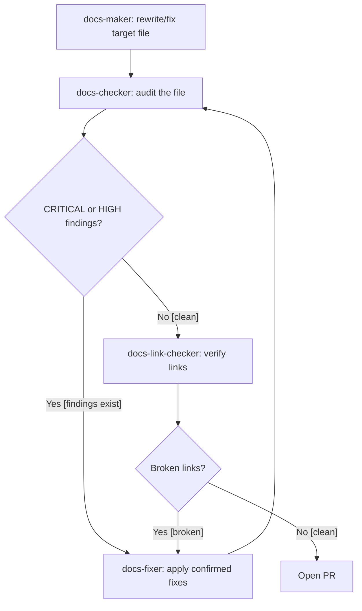
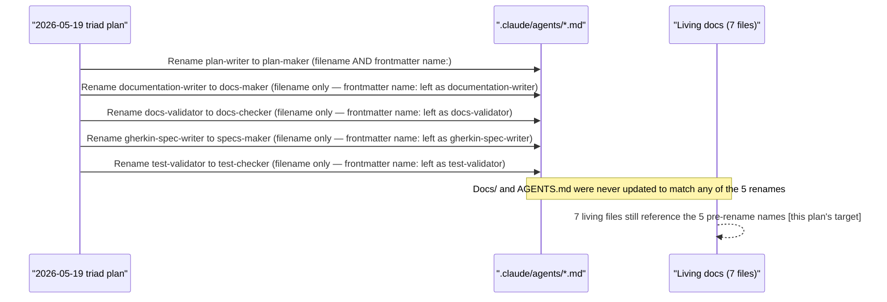

# Technical Design: Fix Claude Agents Catalog Doc

## Architecture Overview

This is a documentation-only change. No application code, CI config, or
agent files are touched. The work follows the maker-checker pattern used for
every other documentation change in this repo: **`docs-maker`** creates/edits
content, **`docs-checker`** validates it, **`docs-fixer`** applies any
confirmed findings before merge.



_Diagram: a file enters the maker-checker-fixer loop and only reaches "Open
PR" once docs-checker reports no CRITICAL/HIGH findings and docs-link-checker
reports no broken links. Decision labels state the condition in text, not
color alone, per `docs-creating-accessible-diagrams`._

### Why this root cause matters



_Diagram: the 2026-05-19 triad plan renamed 5 agent filenames, but only
`plan-maker`'s internal frontmatter `name:` field was updated to match. The
other 4 agents' frontmatter still carries the old name (flagged in the Agent
Roster section below, fixed in a separate follow-up — see
`requirements.md` Non-Scope #1). Separately, and regardless of the
frontmatter bug, no living documentation file was ever updated for any of
the 5 renames — that gap is this plan's target._

## Real Agent Roster (grounded in `.claude/agents/*.md`, read directly)

53 agent files exist (`.claude/agents/*.md`, excluding `.claude/agents/README.md`).
The table below is the family grouping `docs-maker` will use to write the new
`docs/reference/claude-agents.md`. It extends the 3-family pattern already
established in `AGENTS.md` (Documentation, Planning, Testing & Specs) with
the other 12 families AGENTS.md doesn't enumerate — per Q2/Q5 of the
pre-write grill, `AGENTS.md` itself is _not_ expanded to add these; they live
only in the new catalog.

Columns: **Filename** (the file in `.claude/agents/`, always authoritative
for invocation), **Frontmatter `name:`** (flagged with ⚠ where it does not
match the filename — the 4-agent bug from Non-Scope #1), **Model**, **Color**.

### 1. Documentation (6 agents)

| Filename               | Frontmatter `name:`      | Model  | Color  |
| ---------------------- | ------------------------ | ------ | ------ |
| `docs-maker.md`        | ⚠ `documentation-writer` | sonnet | purple |
| `docs-checker.md`      | ⚠ `docs-validator`       | sonnet | blue   |
| `docs-fixer.md`        | `docs-fixer`             | sonnet | orange |
| `docs-file-manager.md` | `docs-file-manager`      | haiku  | yellow |
| `docs-link-checker.md` | `docs-link-checker`      | sonnet | blue   |
| `docs-link-fixer.md`   | `docs-link-fixer`        | sonnet | orange |

### 2. Planning (4 agents)

| Filename                    | Frontmatter `name:`      | Model  | Color  |
| --------------------------- | ------------------------ | ------ | ------ |
| `plan-maker.md`             | `plan-maker`             | sonnet | purple |
| `plan-checker.md`           | `plan-checker`           | sonnet | purple |
| `plan-fixer.md`             | `plan-fixer`             | sonnet | orange |
| `plan-execution-checker.md` | `plan-execution-checker` | sonnet | green  |

### 3. Testing & Specs (6 agents)

| Filename           | Frontmatter `name:`     | Model  | Color  |
| ------------------ | ----------------------- | ------ | ------ |
| `specs-maker.md`   | ⚠ `gherkin-spec-writer` | sonnet | purple |
| `specs-checker.md` | `specs-checker`         | sonnet | blue   |
| `specs-fixer.md`   | `specs-fixer`           | sonnet | orange |
| `test-maker.md`    | `test-maker`            | sonnet | purple |
| `test-checker.md`  | ⚠ `test-validator`      | sonnet | blue   |
| `test-fixer.md`    | `test-fixer`            | sonnet | orange |

### 4. SWE Language Devs (7 agents)

| Filename                | Frontmatter `name:`  | Model  | Color  | Notes                                 |
| ----------------------- | -------------------- | ------ | ------ | ------------------------------------- |
| `swe-typescript-dev.md` | `swe-typescript-dev` | sonnet | purple | IKP-Labs frontend (Next.js)           |
| `swe-java-dev.md`       | `swe-java-dev`       | sonnet | purple | IKP-Labs backend (Spring Boot)        |
| `swe-e2e-dev.md`        | `swe-e2e-dev`        | sonnet | purple | IKP-Labs Playwright E2E/API tests     |
| `swe-golang-dev.md`     | `swe-golang-dev`     | sonnet | purple | Generic — not tied to KameraVue stack |
| `swe-rust-dev.md`       | `swe-rust-dev`       | sonnet | purple | Generic — not tied to KameraVue stack |
| `swe-csharp-dev.md`     | `swe-csharp-dev`     | sonnet | purple | Generic — not tied to KameraVue stack |
| `swe-fsharp-dev.md`     | `swe-fsharp-dev`     | sonnet | purple | Generic — not tied to KameraVue stack |

### 5. SWE UI (3 agents)

| Filename            | Frontmatter `name:` | Model  | Color  |
| ------------------- | ------------------- | ------ | ------ |
| `swe-ui-maker.md`   | `swe-ui-maker`      | sonnet | blue   |
| `swe-ui-checker.md` | `swe-ui-checker`    | sonnet | green  |
| `swe-ui-fixer.md`   | `swe-ui-fixer`      | sonnet | yellow |

### 6. SWE Code Quality (1 agent — singleton, no maker/fixer counterpart)

| Filename              | Frontmatter `name:` | Model  | Color |
| --------------------- | ------------------- | ------ | ----- |
| `swe-code-checker.md` | `swe-code-checker`  | sonnet | green |

### 7. CI (2 agents — no maker; workflow files are hand-authored, not generated)

| Filename        | Frontmatter `name:` | Model  | Color  |
| --------------- | ------------------- | ------ | ------ |
| `ci-checker.md` | `ci-checker`        | sonnet | blue   |
| `ci-fixer.md`   | `ci-fixer`          | sonnet | orange |

### 8. PDF Pipeline (3 agents)

| Filename               | Frontmatter `name:` | Model  | Color  |
| ---------------------- | ------------------- | ------ | ------ |
| `pdf-to-md-maker.md`   | `pdf-to-md-maker`   | sonnet | purple |
| `pdf-to-md-checker.md` | `pdf-to-md-checker` | sonnet | green  |
| `pdf-to-md-fixer.md`   | `pdf-to-md-fixer`   | sonnet | yellow |

### 9. README (3 agents)

| Filename            | Frontmatter `name:` | Model  | Color  |
| ------------------- | ------------------- | ------ | ------ |
| `readme-maker.md`   | `readme-maker`      | sonnet | purple |
| `readme-checker.md` | `readme-checker`    | sonnet | blue   |
| `readme-fixer.md`   | `readme-fixer`      | sonnet | orange |

### 10. Repo Governance (7 agents)

| Filename                   | Frontmatter `name:`     | Model  | Color  |
| -------------------------- | ----------------------- | ------ | ------ |
| `repo-rules-maker.md`      | `repo-rules-maker`      | sonnet | purple |
| `repo-rules-checker.md`    | `repo-rules-checker`    | sonnet | blue   |
| `repo-rules-fixer.md`      | `repo-rules-fixer`      | sonnet | orange |
| `repo-workflow-maker.md`   | `repo-workflow-maker`   | sonnet | purple |
| `repo-workflow-checker.md` | `repo-workflow-checker` | sonnet | blue   |
| `repo-workflow-fixer.md`   | `repo-workflow-fixer`   | sonnet | orange |
| `repo-setup-manager.md`    | `repo-setup-manager`    | sonnet | blue   |

### 11. Repo Harness Compatibility (2 agents)

| Filename                                | Frontmatter `name:`                  | Model  | Color  |
| --------------------------------------- | ------------------------------------ | ------ | ------ |
| `repo-harness-compatibility-checker.md` | `repo-harness-compatibility-checker` | sonnet | green  |
| `repo-harness-compatibility-fixer.md`   | `repo-harness-compatibility-fixer`   | sonnet | yellow |

### 12. PR Review (2 agents — maker/fixer only, no separate checker; the maker is itself the review step)

| Filename             | Frontmatter `name:` | Model  | Color  |
| -------------------- | ------------------- | ------ | ------ |
| `pr-review-maker.md` | `pr-review-maker`   | sonnet | blue   |
| `pr-review-fixer.md` | `pr-review-fixer`   | sonnet | yellow |

### 13. Web & API Testing / Research (5 agents)

| Filename                    | Frontmatter `name:`      | Model  | Color |
| --------------------------- | ------------------------ | ------ | ----- |
| `web-exploratory-tester.md` | `web-exploratory-tester` | sonnet | green |
| `web-design-tester.md`      | `web-design-tester`      | sonnet | green |
| `web-usability-tester.md`   | `web-usability-tester`   | sonnet | green |
| `api-exploratory-tester.md` | `api-exploratory-tester` | sonnet | green |
| `web-research-maker.md`     | `web-research-maker`     | sonnet | blue  |

### 14. Social (1 agent — singleton)

| Filename                        | Frontmatter `name:`          | Model  | Color  |
| ------------------------------- | ---------------------------- | ------ | ------ |
| `social-linkedin-post-maker.md` | `social-linkedin-post-maker` | sonnet | orange |

### 15. Agent Development (1 agent — singleton, meta)

| Filename         | Frontmatter `name:` | Model  | Color |
| ---------------- | ------------------- | ------ | ----- |
| `agent-maker.md` | `agent-maker`       | sonnet | blue  |

**Total: 6+4+6+7+3+1+2+3+3+7+2+2+5+1+1 = 53.** Matches
`ls .claude/agents/*.md | grep -v README.md | wc -l`.

### How the catalog handles the 4 flagged (⚠) agents

For `docs-maker.md`, `docs-checker.md`, `specs-maker.md`, `test-checker.md`,
the new `claude-agents.md` entry documents:

- The filename as the agent's current, correct identity (what this plan and
  every other living doc now call it).
- An explicit note: _"Known issue: this agent's frontmatter `name:` field
  still reads `<old-name>` rather than `<filename>`, a leftover from the
  2026-05-19 rename. Invocation by `@<filename>` is the repo convention
  going forward; this mismatch is tracked for a follow-up `agent-maker` fix,
  out of scope for this plan — see `plans/in-progress/2026-10-08__fix-claude-agents-catalog-doc/requirements.md`
  Non-Scope #1."_
- This note appears once per flagged agent, not as a separate top-level
  section — it belongs next to the agent it describes.

## Per-File Change Specification

### 1. `docs/reference/claude-agents.md` (full rewrite)

**Current**: 984 lines, fictional 6-agent model, ASCII architecture diagram,
"Quick Reference" table, per-agent sections for the 6 fictional
makers/validators, fictional example findings, fictional metrics.

**New structure**:

```markdown
# Claude Agents Catalog

[Overview: 53 real agents, maker-checker-fixer pattern, link to
agent-developing-agents skill for file structure conventions]

## How to Read This Catalog

[Filename = invocation identity. Flags the 4-agent frontmatter mismatch
once, generally, before the family tables — not just inline per-agent.]

## Agent Families

### 1. Documentation

[table: Agent | Role (Maker/Checker/Fixer/Manager) | Purpose | Model | Skills]
...

### 2. Planning

...

[... all 15 families from the Real Agent Roster above, each with a short
family-purpose line and a table of its agents]

## Maker-Checker-Fixer Pattern

[Real mermaid diagram — not the old ASCII art — showing the generic
maker → checker → fixer loop every family follows, using real agent
family examples instead of the fictional 3-maker/3-validator pairing]

## Skills Reference

[Table of real skills in .claude/skills/*/SKILL.md, cross-referenced to
which families use them — read from the real skills directory, not the
old fictional 6-skill list]

## Related Documentation

[Links to AGENTS.md, agent-developing-agents skill, docs/how-to/use-claude-validators.md]
```

**Removed entirely**: the fictional "Agent Architecture" ASCII diagram, the
"Quick Reference" table built around the 6 fictional names, all fictional
example findings/metrics ("Last Month: 65% coverage" etc. — fabricated
numbers with no source), the "Troubleshooting" section's example commands
that reference fictional agents.

### 2. `docs/how-to/use-claude-validators.md` (rewrite in place)

Keep the file's existing purpose (a focused how-to for running the 3
checker agents) and its existing path. Changes:

- Title/intro: "validator" → "checker" terminology throughout.
- `test-validator` → `test-checker`, `docs-validator` → `docs-checker` (23
  occurrences). `plan-checker` is already correctly named — no change needed
  for that one.
- "Available Validators" table and all `@test-validator`/`@docs-validator`
  usage examples corrected to real names.
- Report file-name patterns (`test-audit-*.md`, `docs-audit-*.md`,
  `plan-audit-*.md`) are unchanged — those are correct regardless of agent
  name.
- Does **not** expand to cover all 53 agents — stays scoped to the 3
  checkers, per Q3 of the pre-write grill.

### 3. `docs/how-to/create-implementation-plans.md` (targeted fix)

8 occurrences of `@plan-writer` / `plan-writer` (lines ~44-50, ~1005-1006,
~1085-1090 per current content) corrected to `@plan-maker` / `plan-maker`.
The "Related Documentation" link to `use-claude-validators.md` stays as-is
— that link target still exists after file #2's rewrite (same path).

### 4. `AGENTS.md` (targeted fix, minimal per Q2)

Correct only the agent names inside the existing 3 family tables and
downstream references to them:

- Agent Families → Documentation table: `documentation-writer` → `docs-maker`,
  `docs-validator` → `docs-checker`
- Agent Families → Planning table: `plan-writer` → `plan-maker`
- Agent Families → Testing & Specs table: `gherkin-spec-writer` → `specs-maker`,
  `test-validator` → `test-checker`
- Skills Catalog table ("Used by" column): same 5 substitutions wherever
  they appear
- Generated Reports table ("Generated by" column): `test-validator` →
  `test-checker`, `docs-validator` → `docs-checker`

No new family rows added (per Q2 Recommended — AGENTS.md stays a partial
sample; `docs/reference/claude-agents.md` is the complete source of truth).

### 5. `README.md` (repo root, targeted fix)

In the "Claude Validators" section (current lines ~477-503):

- Table: `@test-validator` → `@test-checker`, `@docs-validator` →
  `@docs-checker` (`@plan-checker` unchanged — already correct)
- Usage example block: same substitutions
- Add one line after the table, e.g.: _"For the complete agent catalog
  (53 agents across 15 families), see
  [`docs/reference/claude-agents.md`](docs/reference/claude-agents.md)."_

### 6. `generated-reports/README.md` (targeted fix)

5 occurrences of `test-validator` / `docs-validator` corrected to
`test-checker` / `docs-checker`. `plan-checker` references are already
correct.

### 7. `docs/reference/README.md` (targeted fix)

The one-line blurb under "Claude Agents" currently reads:

> Complete reference for all Claude agents in the project, including maker
> agents (plan-writer, documentation-writer, gherkin-spec-writer) and
> validator agents (test-validator, docs-validator, plan-checker).

Replaced with a description matching the rewritten catalog's actual scope,
e.g.:

> Complete reference for all 53 Claude agents in the project, grouped by
> family (Documentation, Planning, Testing & Specs, SWE Language Devs, and
> 11 more).

## PR Architecture

| PR  | Files touched                                                                        | Maker/Checker cycle                                                                                       |
| --- | ------------------------------------------------------------------------------------ | --------------------------------------------------------------------------------------------------------- |
| 1   | None (plan files only, already written in this session)                              | N/A                                                                                                       |
| 2   | `docs/reference/claude-agents.md`                                                    | `docs-maker` writes → `docs-checker` audits → `docs-fixer` if needed → `docs-link-checker`                |
| 3   | `docs/how-to/use-claude-validators.md`, `docs/how-to/create-implementation-plans.md` | `docs-maker` writes both → `docs-checker` audits both → `docs-fixer` if needed                            |
| 4   | `AGENTS.md`, `README.md`, `generated-reports/README.md`, `docs/reference/README.md`  | `docs-maker` applies all 4 mechanical find/replace fixes → `docs-checker` audits → `docs-fixer` if needed |
| 5   | None (validation only)                                                               | `docs-checker` full re-run + `docs-link-checker` full repo scan; move plan folder to `plans/done/`        |

PRs 2, 3, and 4 are independent of each other (no file overlap) and can be
opened in any order after PR 1 merges, though the numbering above reflects
the recommended sequence (highest-risk, highest-line-count file first).

## Integration Points

- **`agent-developing-agents` skill** — not modified by this plan, but
  `docs-maker` reads it to understand the `<domain>-<role>.md` naming
  convention and frontmatter structure it's cataloging.
- **`docs-applying-diataxis-framework` skill** — `claude-agents.md` stays in
  `docs/reference/` (information-oriented), confirmed correct category; no
  recategorization needed.
- **`repo-syncing-with-ose-primer` skill** — explicitly not invoked. This
  plan has zero interaction with `wahidyankf/ose-public`; it is a 100%
  internal documentation fix.
